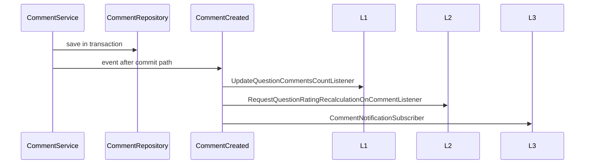

# Comment

Комментарии к вопросам: дерево через `parent_id`, soft delete с причиной, голосование, влияние на `questions.comments_count` и rating.

## Модель

`app/Models/Comment.php`

| Поле | Описание |
|------|----------|
| `question_id`, `user_id` | Привязка к вопросу и автору |
| `parent_id` | Ответ на комментарий (nullable) |
| `body` | Текст |
| `likes_count` | Денормализованная сумма голосов |
| `deleted_at`, `deleted_by_id` | Soft delete |
| `deleted_reason_code`, `deleted_reason_comment` | `App\Enums\Comment\ReasonForDeletion` |

## API

| Method | Route | Permission |
|--------|-------|------------|
| GET | `api/v1/questions/{question}/comments` | `view-any-comment` |
| POST | `api/v1/questions/{question}/comments` | `create-comment` |
| PATCH | `api/v1/comments/{comment}` | `edit-own-comment` / policy |
| DELETE | `api/v1/comments/{comment}` | `delete-own-comment` |
| POST | `api/v1/comments/{restorable_comment}/restore` | `restore-own-comment` |
| PUT | `api/v1/comments/{comment}/vote` | `vote-comment` |

Nested list/store — under questions; update/delete/restore/vote — prefix `comments/`.

## Flow (create)

## Code map

| Layer | Path |
|-------|------|
| Model | `app/Models/Comment.php` |
| Service | `app/Services/api/v1/Comment/CommentService.php` |
| Repository | `app/Repositories/v1/Comment/CommentRepository.php` |
| Controller | `app/Http/Controllers/v1/CommentController.php` |
| Policy | `app/Policies/CommentPolicy.php` |
| Filament | `app/Filament/Resources/CommentResource.php` |
| Tests | `tests/Feature/v1/Comment/` |

## Related

- [moderation-and-soft-delete.md](moderation-and-soft-delete.md)
- [question/aggregates.md](../question/aggregates.md)
- [vote/README.md](../vote/README.md)

## Planning

- [phase-vii.md](../../planning/phase-vii.md) — Filament UI
- [phase-ix.md — Шаг 03](../../planning/phase-ix.md) — sync aggregates + rating
