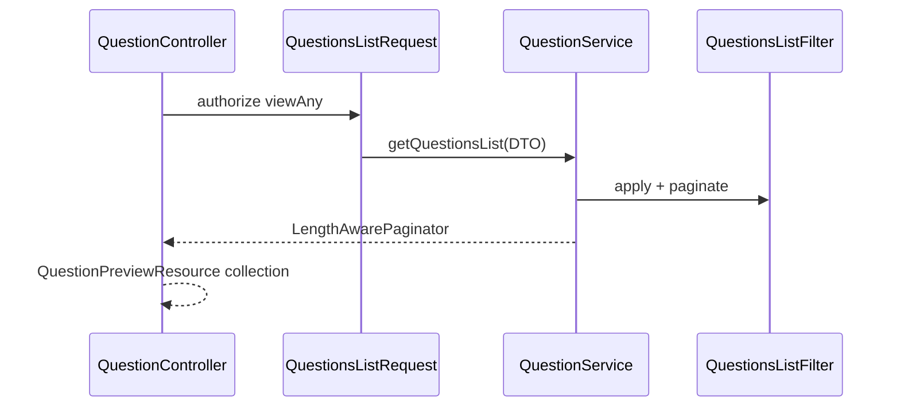

# Question — список и фильтры

## Purpose

Публичный (с проверкой permissions) список approved-вопросов с поиском, фильтрами по таксономии и сортировкой.

## API

| Method | Route | Permission |
|--------|-------|------------|
| GET | `api/v1/questions/list` | `view-any-question` (`QuestionsListRequest`) |

Route name: `api.v1.questions.list`.

## Flow

## Фильтры и сортировка

`QuestionsListFilter` (`app/Http/Filters/v1/Question/QuestionsListFilter.php`):

| Query param | Поведение |
|-------------|-----------|
| `title` | LIKE по `questions.title` |
| `tagIds[]` | `whereHas('tags')` |
| `gradeIds[]` | `whereHas('grades')` |
| `companyIds[]` | `whereHas('companies')` — только если `user->can('viewAny', Company::class)` (premium) |
| `sort` | `title`, `-title`, `rating`, `-rating`, `published_at`, `-published_at` |

Eager load: `tags`, `grades`, `companies`.

Pagination: `setting('question.per_page', 15)`.

## Permissions

- `view-any-question` — доступ к списку
- `view-premium-question` — видимость premium-вопросов (логика в scope/policy, см. тесты)
- `view-any-company` — фильтр по `companyIds` (regular user получает validation error `prohibited`)

## Code map

| Component | Path |
|-----------|------|
| Controller | `app/Http/Controllers/v1/QuestionController.php` |
| Request | `app/Http/Requests/v1/Question/QuestionsListRequest.php` |
| DTO | `app/DTOs/v1/Question/QuestionsFilterDTO.php` |
| Filter | `app/Http/Filters/v1/Question/QuestionsListFilter.php` |
| Resource | `app/Http/Resources/v1/Question/QuestionPreviewResource.php` |
| Tests | `tests/Feature/v1/Question/QuestionsTest.php` |

## Admin

Список и модерация — `QuestionResource` в Filament (группа Main).

## Related

- [taxonomy/README.md](../taxonomy/README.md)
- [README.md](README.md)

## Planning

- Не отдельная фаза; базовый CRUD/API до phase-vii.
