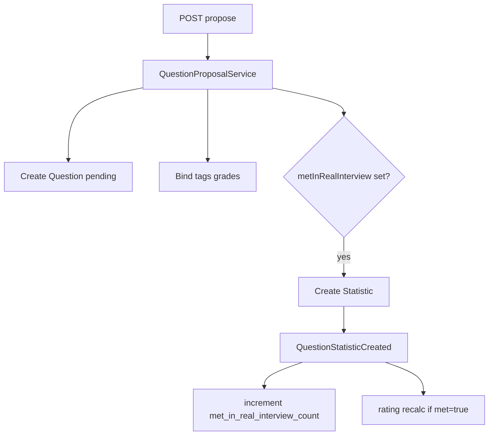

# Question — propose и statistics

## Purpose

Пользователь предлагает новый вопрос через API. Опционально заполняет блок «интервью»: встречался ли на собеседовании, когда, company/position. Создаётся `Statistic` и при необходимости новые tags/companies/positions.

## API

| Method | Route | Permission |
|--------|-------|------------|
| POST | `api/v1/questions/propose` | `propose-question` |

Route name: `api.v1.questions.propose`. Middleware: `auth:sanctum`.

## Flow

## Statistic

Модель `Statistic`:

- `met_in_real_interview` — boolean
- `when_asked` — `App\Enums\Period` (если met = true)
- `company_id`, `position_id` — existing или созданные через resolvers

Событие `QuestionStatisticCreated` (`ShouldDispatchAfterCommit`) запускает listeners для агрегата и rating.

## Settings

| Key | Section | Назначение |
|-----|---------|------------|
| `max_records_per_user_question` | `statistics` | Лимит опросов на user+question |
| `company_suggestion_evidence_threshold` | `statistics` | Порог для suggestion company |
| `position_suggestion_evidence_threshold` | `statistics` | Порог для suggestion position |

## Resolvers

- `TagResolver`, `CompanyResolver`, `PositionResolver` — deduplicate existing vs create new

## Code map

| Component | Path |
|-----------|------|
| Service | `app/Services/api/v1/QuestionProposalService.php` |
| Request | `app/Http/Requests/v1/Question/QuestionProposalRequest.php` |
| DTO | `app/DTOs/v1/Question/QuestionProposalDTO.php` |
| Event | `app/Events/v1/Question/QuestionStatisticCreated.php` |
| Listener | `app/Listeners/v1/Question/UpdateQuestionMetInRealInterviewCountListener.php` |
| Tests | `tests/Feature/v1/Question/QuestionsProposeTest.php`, `QuestionMetInRealInterviewCountTest.php` |

## Related

- [aggregates.md](aggregates.md)
- [suggestion/README.md](../suggestion/README.md)
- [taxonomy/README.md](../taxonomy/README.md)

## Planning

- [phase-viii.md — Шаг 06](../../planning/phase-viii.md) (денормализация met count)
