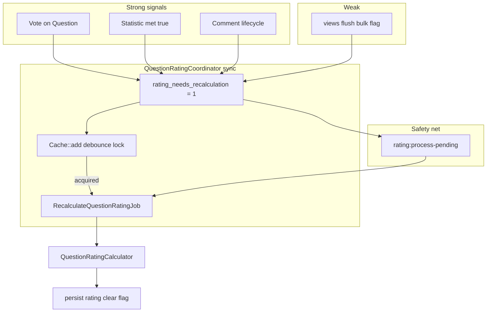

# Question — рейтинг (rating)

## Purpose

Вычисление и сохранение `questions.rating` из денормализованных агрегатов. Coordinator снижает шум в очереди: debounce, unique job, safety-net command.

**MVP:** без aging по `published_at`.

## Формула

`QuestionRatingCalculator`:

```
rating = round(
  likes_count * setting('rating_weights.votes')
  + met_in_real_interview_count * setting('rating_weights.met')
  + ln(views_count + 1) * setting('rating_weights.views')
  + ln(comments_count + 1) * setting('rating_weights.comments')
)
```

Weights по умолчанию: votes=1.0, met=3.0, views=0.3, comments=0.7.

## Flow



## Coordinator

`QuestionRatingCoordinator::requestRecalc(int $questionId)`:

1. `UPDATE questions SET rating_needs_recalculation = 1`
2. `Cache::add("rating:recalc:lock:question:{id}", …, TTL = `question.rate-limit-seconds`)`
3. Если lock acquired → `RecalculateQuestionRatingJob::dispatch()->onQueue(Queue::Rating)`

## Job

`RecalculateQuestionRatingJob`:

- `ShouldBeUnique` per questionId
- Running lock: `Cache::lock("rating:recalc:running:question:{id}")`
- Handler → `QuestionRatingService::recalculate()` → `QuestionRepository::persistRating()`

## Safety net

`rating:process-pending` — every 5 minutes. Command: `ProcessPendingRatingRecalculationsCommand`. Dispatch jobs для всех questions с `rating_needs_recalculation = true`.

## Entry points

| Trigger | Path |
|---------|------|
| Event | `QuestionRatingNeedsRecalculation` → `RequestQuestionRatingRecalculationListener` |
| Vote | `RequestQuestionRatingRecalculationOnVoteListener` (Question only) |
| Comment | `RequestQuestionRatingRecalculationOnCommentListener` |
| Statistic | через met listener + coordinator |

## Code map

| Component | Path |
|-----------|------|
| Coordinator | `app/Services/api/v1/Question/QuestionRatingCoordinator.php` |
| Calculator | `app/Services/api/v1/Question/QuestionRatingCalculator.php` |
| Service | `app/Services/api/v1/Question/QuestionRatingService.php` |
| Job | `app/Jobs/RecalculateQuestionRatingJob.php` |
| Command | `app/Console/Commands/ProcessPendingRatingRecalculationsCommand.php` |
| Trait | `app/Traits/Question/MarksQuestionForRatingRecalculation.php` |
| Tests | `QuestionRatingCoordinatorTest`, `QuestionRatingRecalculationTest`, `ProcessPendingRatingRecalculationsTest`, `QuestionRatingServiceTest` |

## Related

- [aggregates.md](aggregates.md)
- [views.md](views.md)
- [explanation/architecture/denormalized-aggregates.md](../../explanation/architecture/denormalized-aggregates.md)

## Planning

- [phase-ix.md — Шаги 01–02](../../planning/phase-ix.md)
