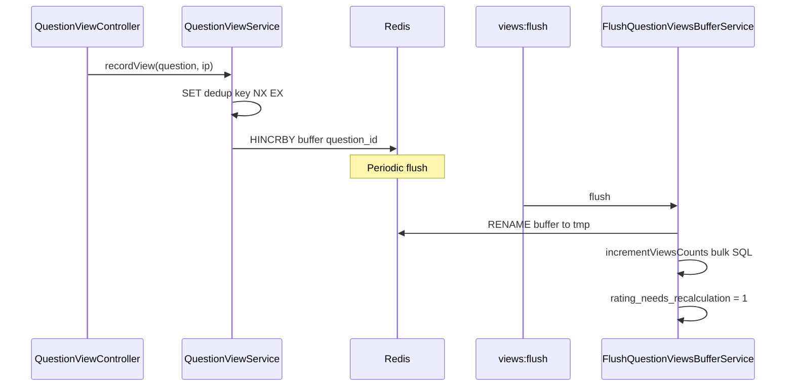

# Question — просмотры (views)

## Purpose

Подсчёт просмотров вопроса без записи в MySQL на каждый HTTP-запрос. IP-дедупликация и буфер в Redis; периодический flush в `questions.views_count`.

## API

| Method | Route | Auth | Throttle |
|--------|-------|------|----------|
| POST | `api/v1/questions/{question}/view` | Public | `throttle:question-view` |

Route name: `api.v1.questions.view.store`.

## Flow

## Weak signal для rating

Bulk flush **не** диспатчит `QuestionRatingNeedsRecalculation` на каждый id. `QuestionRepository::incrementViewsCounts` обновляет `views_count` и ставит `rating_needs_recalculation = true`. Пересчёт — через debounced job или `rating:process-pending`.

## Config

| Source | Key |
|--------|-----|
| `config/settings.php` Section `QuestionViews` | `dedup_ttl_seconds`, `flush_lock_seconds`, `rate_limit_per_minute` |
| `config/question_views.php` | Redis buffer keys, flush chunk size |
| `RedisMacroServiceProvider` | `Redis::setnxex()` |

Helper: `setting('question_views.dedup_ttl_seconds')`.

## Schedule

`views:flush` — every minute, `withoutOverlapping()` ([`routes/console.php`](../../routes/console.php)).

Command: `FlushQuestionViewsBufferCommand` → `FlushQuestionViewsBufferService::flush()`.

Lock: `Cache::lock('flush-question-views', flush_lock_seconds)`.

## Code map

| Component | Path |
|-----------|------|
| Controller | `app/Http/Controllers/v1/Question/QuestionViewController.php` |
| Service | `app/Services/api/v1/Question/QuestionViewService.php` |
| Flush | `app/Services/api/v1/Question/FlushQuestionViewsBufferService.php` |
| Command | `app/Console/Commands/FlushQuestionViewsBufferCommand.php` |
| Repository | `QuestionRepository::incrementViewsCounts()` |
| Tests | `tests/Feature/v1/Question/FlushQuestionViewsTest.php`, `QuestionViewsTest.php` |

## Related

- [rating.md](rating.md)
- [aggregates.md](aggregates.md)

## Planning

- [phase-viii.md — Шаг 07](../../planning/phase-viii.md)
