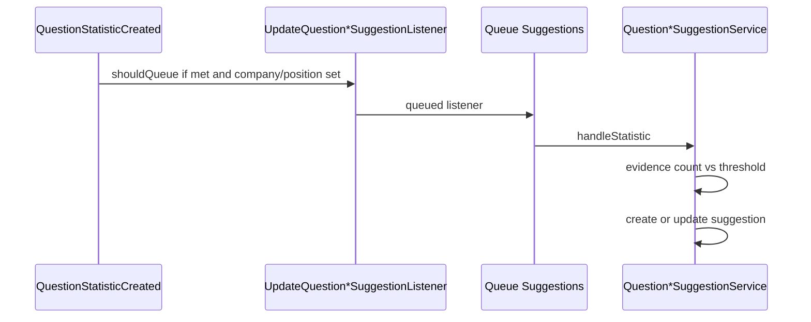

# Suggestion

Предложения связать вопрос с компанией или должностью на основе накопленных statistics (`met_in_real_interview = true`).

## Модели

- `QuestionCompanySuggestion` — `question_id`, `company_id`, status
- `QuestionPositionSuggestion` — `question_id`, `position_id`, status

## Flow

Listeners:

- `UpdateQuestionCompanySuggestionListener` — queue `Queue::Suggestions`, if `met && company_id`
- `UpdateQuestionPositionSuggestionListener` — аналогично для position

## Settings

| Key | Default | Назначение |
|-----|---------|------------|
| `statistics.company_suggestion_evidence_threshold` | 3 | Число met statistics для company suggestion |
| `statistics.position_suggestion_evidence_threshold` | 3 | То же для position |

## Moderation

Filament группа **Moderation**:

- `QuestionCompanySuggestionResource`
- `QuestionPositionSuggestionResource`

Relation managers на `QuestionResource` для inline moderation.

Permissions: `view-any-question-company-suggestion`, `change-status-question-company-suggestion`, …

## Code map

| Component | Path |
|-----------|------|
| Services | `app/Services/api/v1/Suggestion/QuestionCompanySuggestionService.php`, `QuestionPositionSuggestionService.php` |
| Listeners | `app/Listeners/v1/Suggestion/` |
| Filament | `app/Filament/Resources/QuestionCompanySuggestionResource.php`, `QuestionPositionSuggestionResource.php` |

## Related

- [question/propose-and-statistics.md](../question/propose-and-statistics.md)
- [taxonomy/README.md](../taxonomy/README.md)

## Planning

- Evidence thresholds — [phase-viii.md — Шаг 06](../../planning/phase-viii.md)
