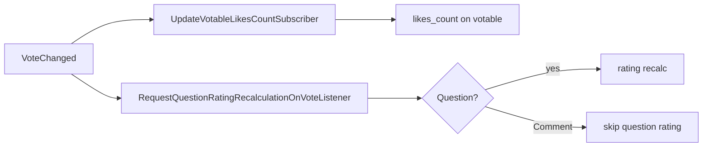

# Vote

Полиморфные лайки и дизлайки на `Question` и `Comment`. Значение `votes.value`: `+1` (like), `-1` (dislike). На сущности хранится денормализованная **сумма** `likes_count` (может быть отрицательной).

## Модель

`app/Models/Vote.php` — `user_id`, `votable_id`, `votable_type`, `value`. Unique `(user_id, votable_id, votable_type)`.

`ModelVotesInterface` — контракт для Question и Comment.

## VoteService

| Method | Поведение |
|--------|-----------|
| `set($user, $votable, $value)` | Создать или переключить; no-op если value уже установлен |
| `clear($user, $votable)` | Удалить голос; idempotent |

После транзакции — `event(new VoteChanged($votable, $delta))`.

## Side effects

## API

| Target | Method | Route |
|--------|--------|-------|
| Question | PUT | `api/v1/questions/{question}/vote` |
| Comment | PUT | `api/v1/comments/{comment}/vote` |

Permissions: `vote-question`, `vote-comment`. Request body: `{ "value": 1 | -1 }` или clear через отдельный контракт (см. `VoteServiceSetClearTest`).

## Filament

Только отображение `likes_count` на Question и Comment (phase VIII step 05). Голосование из админки не требуется.

## Code map

| Layer | Path |
|-------|------|
| Model | `app/Models/Vote.php` |
| Service | `app/Services/api/v1/Vote/VoteService.php` |
| Likes count | `app/Services/api/v1/Vote/VotableLikesCountService.php` |
| Repository | `app/Repositories/v1/Vote/VoteRepository.php` |
| Controllers | `QuestionVoteController`, `CommentVoteController` |
| Event | `app/Events/v1/Vote/VoteChanged.php` |
| Tests | `tests/Feature/v1/Vote/`, `QuestionsVoteTest`, `CommentsVoteTest` |

## Related

- [question/rating.md](../question/rating.md)
- [question/aggregates.md](../question/aggregates.md)

## Planning

- [phase-viii.md — Шаги 01–05](../../planning/phase-viii.md)
