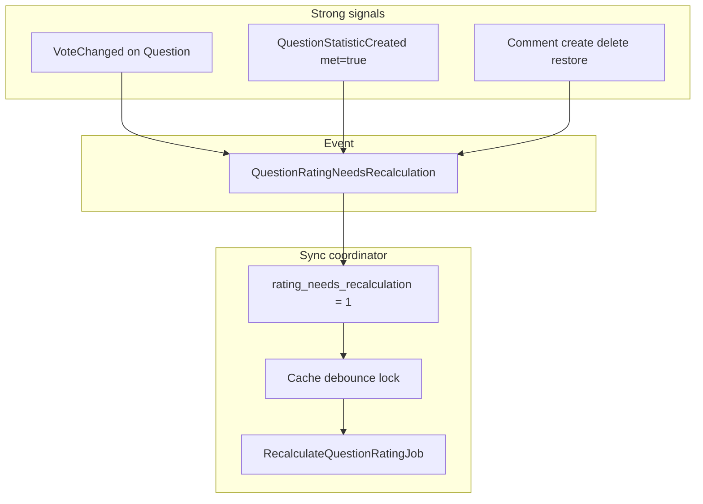

# События и побочные эффекты

Доменные события диспатчатся из сервисов после успешной записи. Listeners и subscribers живут в `app/Listeners/v1/`. Регистрация — через Laravel event discovery.

## Карта событий

| Event | Listeners / subscribers | Эффект |
|-------|-------------------------|--------|
| `VoteChanged` | `UpdateVotableLikesCountSubscriber` | Обновляет `likes_count` на Question или Comment |
| `VoteChanged` | `RequestQuestionRatingRecalculationOnVoteListener` | Запрос пересчёта rating **только** если votable — `Question` |
| `CommentCreated` | `UpdateQuestionCommentsCountListener` | `questions.comments_count++` |
| `CommentCreated` | `RequestQuestionRatingRecalculationOnCommentListener` | Strong signal → rating recalc |
| `CommentDeleted` | те же listeners | `comments_count--`, rating recalc |
| `CommentRestored` | те же listeners | `comments_count++`, rating recalc |
| `CommentCreated` | `CommentNotificationSubscriber` | In-app уведомления |
| `QuestionStatisticCreated` | `UpdateQuestionMetInRealInterviewCountListener` | `met_in_real_interview_count++` (если `met_in_real_interview = true`) |
| `QuestionStatisticCreated` | (через aggregate + coordinator) | Strong signal → rating recalc |
| `QuestionRatingNeedsRecalculation` | `RequestQuestionRatingRecalculationListener` | `QuestionRatingCoordinator::requestRecalc` |

## ShouldDispatchAfterCommit

События с `ShouldDispatchAfterCommit` не обрабатываются до commit транзакции:

- `QuestionRatingNeedsRecalculation`
- `QuestionStatisticCreated`

Это гарантирует, что listeners видят согласованные данные в БД.

## Jobs (асинхронные задачи)

| Job | Очередь | Назначение |
|-----|---------|------------|
| `RecalculateQuestionRatingJob` | `Queue::Rating` | Пересчёт `questions.rating` из агрегатов |
| `FlushQuestionViewsBufferJob` | default (sync в command) | Обёртка над flush (command вызывает service напрямую) |
| `SendNotificationBatchJob` | `Queue::Notifications` | Пакетная отправка уведомлений |
| `DispatchMassAdminNotificationJob` | `Queue::Notifications` | Массовая рассылка из админки |

Подробнее: [reference/jobs-and-commands.md](../../reference/jobs-and-commands.md).

## Поток rating (упрощённо)

Weak signal (bulk flush просмотров): только SQL-флаг `rating_needs_recalculation`, без события на каждый question id. См. [domains/question/views.md](../../domains/question/views.md).

## Где не использовать события

- Голос за **Comment** не должен триггерить пересчёт rating **Question** (фильтр в `RequestQuestionRatingRecalculationOnVoteListener`).
- Flush просмотров — bulk update + флаг, не N событий.

## Связанные разделы

- [Денормализованные агрегаты](denormalized-aggregates.md)
- [domains/question/rating.md](../../domains/question/rating.md)
- [domains/vote/README.md](../../domains/vote/README.md)
