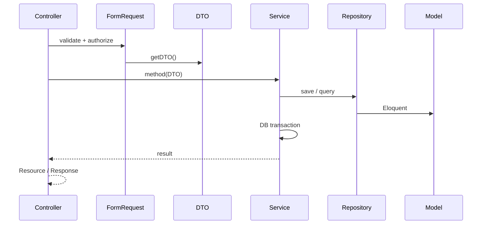

# Слои приложения

API построен по классической Laravel-схеме с явным разделением ответственности. Конвенции при правках кода — в [`.cursor/rules/laravel-architecture.mdc`](../../.cursor/rules/laravel-architecture.mdc).

## Поток запроса

## Роли слоёв

| Слой | Путь | Ответственность |
|------|------|-----------------|
| Controllers | `app/Http/Controllers/v1/` | Тонкий HTTP-слой: Form Request, DTO, вызов сервиса, Resource |
| Form Requests | `app/Http/Requests/v1/` | Валидация, `authorize()`, сбор DTO |
| DTOs | `app/DTOs/v1/{Domain}/` | `readonly` promoted properties, передача данных в сервис |
| Services | `app/Services/api/v1/` | Use cases, транзакции, события после persist |
| Repositories | `app/Repositories/v1/` | Запись в БД, доменные запросы |
| Filters | `app/Http/Filters/v1/` | Построение query для списков (не в контроллере) |
| Resources | `app/Http/Resources/v1/` | JSON-представление для API |
| Policies | `app/Policies/`, `app/Policies/v1/` | Авторизация на уровне модели |
| Listeners | `app/Listeners/v1/` | Реакция на domain events |

## Правила сервисов

- **Запись только через repository:** `$this->repository->save($model)`, `insert()`, `bulkUpdate()` — не `$model->save()` в сервисе.
- **>2 логических аргументов → DTO:** например `CommentService::deleteWithReason(CommentDeleteWithReasonDTO $dto)` вместо длинного списка параметров.
- **Транзакции:** `DB::transaction()` в сервисе при нескольких изменениях.
- **События:** диспатч после успешной персистенции (`CommentCreated`, `VoteChanged`, …).

## Пример цепочки

`QuestionController::list` → `QuestionsListRequest` → `QuestionsListDTO` → `QuestionService::getQuestionsList` → `QuestionsListFilter` → `QuestionPreviewResource`.

## Filament

Админ-панель (`app/Filament/`) использует те же модели и часто те же сервисы, но не дублирует API-контроллеры. Ресурсы, relation managers, actions — см. [reference/admin/filament-resources.md](../../reference/admin/filament-resources.md).

## Связанные разделы

- [Авторизация](authorization.md)
- [События и побочные эффекты](events-and-side-effects.md)
- [Repositories](../../.cursor/rules/repositories.mdc)
