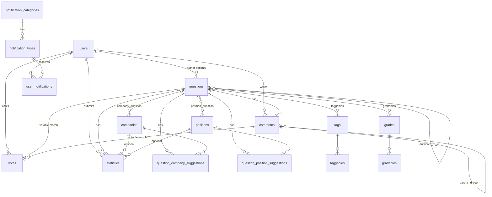

# ER-обзор

Диаграмма основных связей. Детальный FK-граф для очистки тестов — [tables-by-domain.md](tables-by-domain.md).

## Self-reference: duplicates

`questions.duplicate_of_id` → `questions.id`, `nullOnDelete`. Дубликат указывает на канонический вопрос.

## Soft deletes

| Таблица | Механизм |
|---------|----------|
| `questions` | `SoftDeletes` |
| `comments` | `SoftDeletes` + `deleted_by_id`, `deleted_reason_code` |
| `companies`, `positions`, `tags` | status + soft delete где применимо в домене |

Статус «удалён» у комментария в UI — по `deleted_at`, не отдельное поле `is_deleted`.

## Полиморфные связи

| Таблица | Morph name | Targets |
|---------|------------|---------|
| `votes` | `votable` | `Question`, `Comment` (будущий `Answer`) |
| `taggables` | `taggables` | `Question`, … |
| `gradables` | `gradables` | `Question`, … |

## Pivot-таблицы

- `company_question` — связь вопрос ↔ компания (cascade on delete)
- `position_question` — связь вопрос ↔ должность (cascade on delete)

## Связанные разделы

- [tables-by-domain.md](tables-by-domain.md)
- [overview.md](../overview.md)
