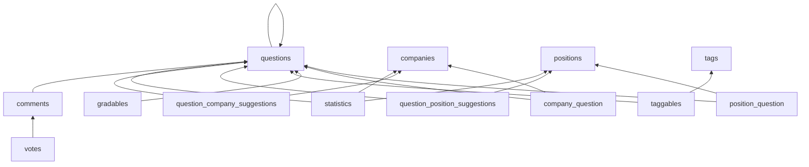

# Таблицы по доменам и FK-граф

Порядок удаления строк в feature-тестах (`DatabaseTransactions` + явная очистка seeded data). Реализация: [`app/Traits/Tests/ClearsTestTables.php`](../../app/Traits/Tests/ClearsTestTables.php).

Подробнее о тестах: [guides/testing.md](../../guides/testing.md).

## Question и зависимости

Удалять **до** `questions`:

1. `votes` — FK на users; morph на Question/Comment
2. `comments` — FK `question_id`; self-FK `parent_id` (`nullOnDelete`)
3. `statistics` — FK `question_id`, optional `company_id`, `position_id`
4. `question_company_suggestions`, `question_position_suggestions`
5. `taggables`, `gradables` — morph на Question
6. `company_question`, `position_question` — pivot

Метод: `ClearsTestTables::clearQuestionsAndDependencies()`.

## Companies

Блокируют удаление `companies`:

- `question_company_suggestions.company_id`
- `company_question.company_id`
- `statistics.company_id`

Порядок: suggestions → pivot → statistics → companies.

Метод: `clearCompaniesAndDependencies()`.

## Positions

Аналогично companies:

- `question_position_suggestions.position_id`
- `position_question.position_id`
- `statistics.position_id`

Метод: `clearPositionsAndDependencies()`.

## Tags

- `taggables.tag_id` → затем `tags`

Метод: `clearTagsAndDependencies()`.

## Полная очистка домена propose

Для тестов propose/statistics:

`clearQuestionDomainTables()` = questions + dependencies + companies + positions + tags.

## Диаграмма зависимостей (delete order)

## Связанные разделы

- [er-overview.md](er-overview.md)
- [guides/testing.md](../../guides/testing.md)
