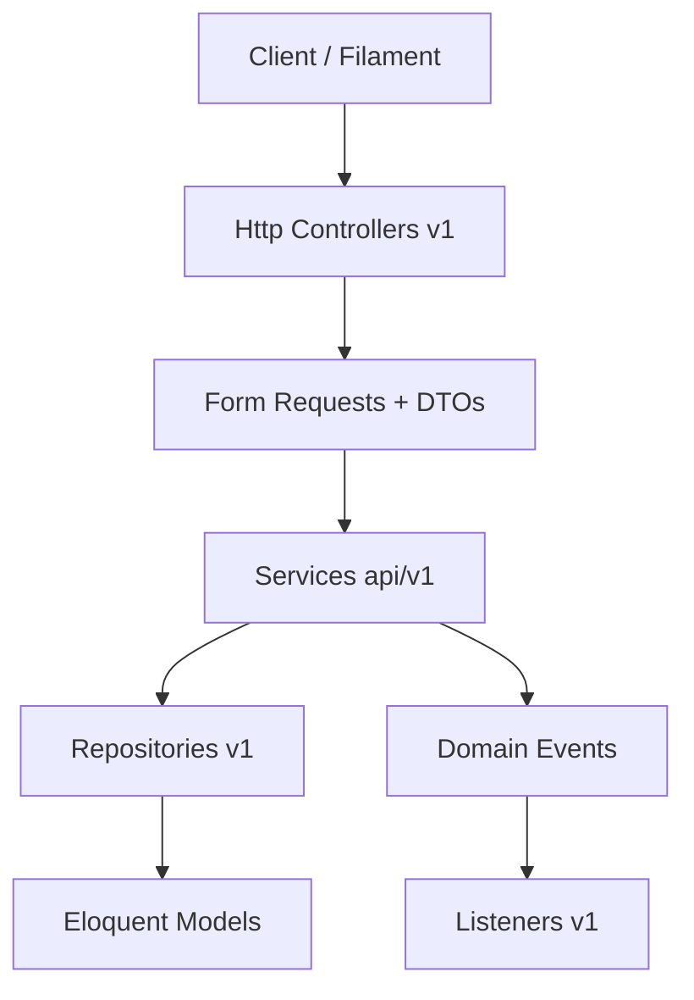
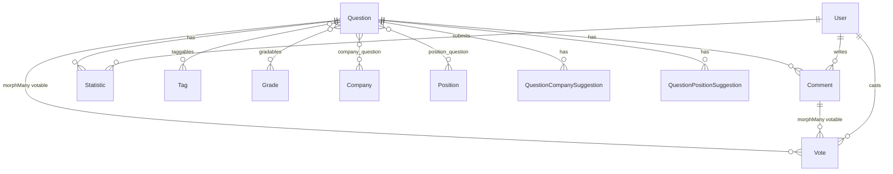

# Обзор системы

## Продукт

TTT Backend — серверная часть базы знаний теоретических вопросов с технических собеседований. Пользователи просматривают и предлагают вопросы, оставляют комментарии, голосуют, сообщают о встречах на реальных собеседованиях. Модераторы и админы работают через Filament (`/admin`).

Pet-проект в активной разработке; API версионирован (`v1`).

## Стек

| Компонент | Технология |
|-----------|------------|
| Framework | Laravel 12, PHP 8.4 |
| Admin | Filament 3 |
| API auth | Laravel Sanctum |
| Roles / permissions | Spatie Permission |
| Cache / queues | Redis, Laravel Horizon |
| DB | MySQL |

## Основные сущности

| Сущность | Назначение |
|----------|------------|
| `Question` | Вопрос: title, answer, status, рейтинг, денормализованные метрики |
| `Comment` | Комментарии к вопросу (дерево через `parent_id`), soft delete |
| `Vote` | Полиморфный лайк/дизлайк (`value` ±1) на Question или Comment |
| `Statistic` | Опрос пользователя: встречался ли вопрос на собеседовании, company/position |
| `QuestionCompanySuggestion` / `QuestionPositionSuggestion` | Предложения связать вопрос с компанией/должностью |
| `Company`, `Position`, `Tag`, `Grade` | Таксономия и фильтрация |
| `NotificationCategory`, `NotificationType`, `UserNotification` | In-app уведомления |
| `User` | Пользователь, роли, ban |

## API

- Префикс: `/api/v1/`
- Имена маршрутов: `api.v1.*` (например `route('api.v1.questions.list')`)
- Ответы обёрнуты в `{ "data": … }` (стандартный Laravel Resource wrap)

Подробнее: [reference/api/README.md](../reference/api/README.md).

## Слои приложения

Детали: [architecture/layering.md](architecture/layering.md).

## Центральная модель Question

Полная ER-модель: [data-model/er-overview.md](data-model/er-overview.md).

## Связанные разделы

- [Архитектура](architecture/layering.md)
- [Денормализованные агрегаты](architecture/denormalized-aggregates.md)
- [Домены](../domains/)
- [Справочники](../reference/)
