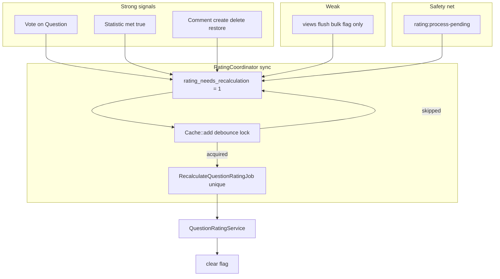

# Этап IX — пересчёт рейтинга вопроса

> **Документация (реализовано):** [domains/question/rating.md](../domains/question/rating.md), [domains/question/aggregates.md](../domains/question/aggregates.md)

Этап описывает экосистему обновления [`questions.rating`](../../app/Models/Question.php) на основе денормализованных агрегатов (`views_count`, `likes_count`, `comments_count`, `met_in_real_interview_count`). Предварительные шаги по агрегатам и флагу `rating_needs_recalculation` — в [phase-viii.md](phase-viii.md) (голоса, опросы, просмотры).

Цель фазы — **снизить шум в очереди**: сотни событий (просмотры, лайки, комментарии) не должны порождать сотни тяжёлых job. Сильные сигналы обновляют агрегаты в БД и запрашивают пересчёт через координатор; слабые (bulk flush просмотров) — только флаг; «догоняющая» job обрабатывает накопившийся флаг.

**MVP:** рейтинг только из **агрегатов** (голоса, встречи, просмотры, комментарии). **Старение по `published_at`** (штраф за возраст, ежедневная job) — **вне scope**, отдельная доработка позже.

Пошаговый план реализации Этапа IX. Каждая секция ниже — отдельный шаг для ИИ-агента: контекст, задача, acceptance criteria, **тесты**, ограничения.

## Соглашения по тестам (обязательно для каждого шага)

См. полный блок в [phase-viii.md](phase-viii.md#соглашения-по-тестам-обязательно-для-каждого-шага). Кратко:

- API и интеграция событий/job — `tests/Feature/v1/…`, образцы [`QuestionsTest`](../../tests/Feature/v1/Question/QuestionsTest.php), [`QuestionsProposeTest`](../../tests/Feature/v1/Question/QuestionsProposeTest.php).
- `QuestionRatingCalculator` и чистая математика — `tests/Unit/v1/Question/…`.
- `DatabaseTransactions`, `WithUser`, именованные маршруты, `Bus::fake()` / `Queue::fake()` / `Artisan::call()` где нужно проверить coordinator и команды.
- Завершение шага: `php artisan test --filter=<pattern>` для новых классов.

**Шаблон для новых шагов:**

```markdown
## Шаг NN: <краткий заголовок>

### Контекст
…

### Задача
…

### Acceptance criteria
- [ ] …

### Тесты
- [ ] …

### Ограничения
- …
```

---

## Шаг 01: Экосистема пересчёта rating (координатор, job, safety-net)

### Контекст

Денормализованные поля на [`Question`](../../app/Models/Question.php) обновляются разными путями (см. phase-viii). Пересчёт `rating` должен использовать **только эти поля**, без тяжёлых `COUNT`/`SUM` по сырым таблицам. Флаг `rating_needs_recalculation` (шаг 07 phase-viii) — источник правды для отложенного пересчёта.

**Каналы сигналов:**

| Канал | Примеры | Агрегат в БД | Запрос пересчёта |
|--------|---------|--------------|------------------|
| **Сильный** | голос за **вопрос**, statistic с `met_in_real_interview = true`, комментарий (create/delete/restore) | сразу | `QuestionRatingCoordinator::requestRecalc` |
| **Слабый** | flush просмотров из Redis | bulk `views_count` + флаг | **без** события на каждый id; только periodic job |

Голос за **комментарий** не должен вызывать пересчёт рейтинга вопроса.



**Финальные архитектурные решения:**

1. **Sync coordinator + unique job** — не queued listener на каждое событие. Синхронный listener вызывает только `RatingCoordinator::requestRecalc($questionId)`; внутри `Cache::add` → при success `RecalculateQuestionRatingJob::dispatch()->onQueue('rating')` с `ShouldBeUnique`, `uniqueId = question:{id}`, `uniqueFor` = `setting('question.rate-limit-seconds')`.
2. **Параллельный пересчёт одного вопроса** — предотвращать `ShouldBeUnique` на job (до завершения) **и/или** `Cache::lock('rating:recalc:running:question:{id}')` на время выполнения job.
3. **Формула rating** — в **шаге 02**; в шаге 01 в `QuestionRatingService::recalculate()` временно допустима заглушка до подключения calculator.

### Задача

1. **Настройки**
   - `setting('question.rate-limit-seconds', 60)` (или 120) — TTL для `Cache::add` debounce и `uniqueFor` job. В `label` подробно описать, для чего используется данный параметр (1-2 предложения).

2. **[`QuestionRatingCoordinator`](../../app/Services/api/v1/Question/QuestionRatingCoordinator.php)** (новый):
   - `requestRecalc(int $questionId): void`:
     - `Question::whereKey($questionId)->update(['rating_needs_recalculation' => true])`.
     - `$lockKey = "rating:recalc:lock:question:{$questionId}"`.
     - `Cache::add($lockKey, 1, setting('question.rate-limit-seconds'))` — при `false` → return (флаг в БД остаётся, подберёт periodic job).
     - `RecalculateQuestionRatingJob::dispatch($questionId)->onQueue(Queue::Rating->value)`.
   - Shared cache driver (Redis) в prod для корректного debounce между воркерами.

3. **Событие [`QuestionRatingNeedsRecalculation`](../../app/Events/v1/Question/QuestionRatingNeedsRecalculation.php)**:
   - `public int $questionId`; `ShouldDispatchAfterCommit` при dispatch из сервисов после commit.
   - Диспатч из coordinator **или** из точек сильного сигнала после обновления агрегата (см. п. 5).

4. **Синхронный listener** [`RequestQuestionRatingRecalculationListener`](../../app/Listeners/v1/Question/RequestQuestionRatingRecalculationListener.php):
   - **Без** `ShouldQueue`.
   - `handle(QuestionRatingNeedsRecalculation $event)` → `$this->coordinator->requestRecalc($event->questionId)`.
   - Не выполнять пересчёт в listener — только coordinator.

5. **Сильные сигналы — подключение в этом шаге** (после обновления агрегата → `event(QuestionRatingNeedsRecalculation)` или прямой вызов coordinator):
   - **Голос за вопрос:** после шага 02 phase-viii — в listener/subscriber на `VoteChanged`, только если votable — `Question` (не `Comment`).
   - **Statistic `met_in_real_interview = true`:** после increment в шаге 06 phase-viii — из listener на `QuestionStatisticCreated`.
   - Общий вспомогательный метод (опционально трейт [`MarksQuestionForRatingRecalculation`](../../app/Traits/Question/MarksQuestionForRatingRecalculation.php)) — **только** `dispatch event` / вызов coordinator, **без** дублирования `increment` агрегатов.

6. **Комментарии — шаг 03:**
   - Подключение comment → coordinator и sync-агрегат `comments_count` — в [шаге 03](#шаг-03-комментарии--sync-агрегат-и-сильный-сигнал-rating).
   - Bulk flush просмотров — **не** диспатчить `QuestionRatingNeedsRecalculation` на каждый question id (только флаг в SQL, шаг 07 phase-viii).

7. **[`RecalculateQuestionRatingJob`](../../app/Jobs/RecalculateQuestionRatingJob.php)**:
   - `ShouldBeUnique`, `uniqueId(): "question:{$this->questionId}"`, `uniqueFor(): setting('question.rate-limit-seconds')`.
   - В `handle()`: optional `Cache::lock('rating:recalc:running:question:{id}', $timeout)` на время пересчёта.
   - Вызов `QuestionRatingService::recalculate($questionId)`.
   - После успеха: `rating_needs_recalculation = false` вместе с записью `rating` (в сервисе или repository).

8. **[`QuestionRatingService::recalculate(int $questionId)`](../../app/Services/api/v1/Question/QuestionRatingService.php)**:
   - Загрузить вопрос; делегировать в `QuestionRatingCalculator` (**шаг 02**).
   - До шага 02: временная заглушка, чтобы pipeline job/coordinator и флаг работали end-to-end.
   - Persist `rating` + `rating_needs_recalculation = false` через repository.

9. **Periodic safety-net** — команда [`rating:process-pending`](../../app/Console/Commands/ProcessPendingRatingRecalculationsCommand.php):
   - Выборка: `questions` где `rating_needs_recalculation = 1`, `orderBy('updated_at')`, chunk/limit (напр. 200 за запуск).
   - На каждый id: `RecalculateQuestionRatingJob::dispatch($id)` **или** inline `recalculate` в command (предпочтительно dispatch с `ShouldBeUnique` / проверкой running lock, чтобы не дублировать логику).
   - [`routes/console.php`](../../routes/console.php): `Schedule::command('rating:process-pending')->everyFiveMinutes()->withoutOverlapping()` (интервал на усмотрение).
   - Назначение: догнать вопросы после skip debounce, падения воркера, слабых сигналов (views).

10. **Очередь Horizon**
    - `Queue::Rating = 'rating'` в [`App\Enums\Queue\Queue`](../../app/Enums/Queue/Queue.php).
    - Supervisor в [`config/horizon.php`](../../config/horizon.php) (отдельно от `notification`, `views-flush`).

11. **Миграция** (если `rating_needs_recalculation` ещё не добавлен в phase-viii шаг 07):
    - `boolean`, `default(false)` на `questions`.

### Acceptance criteria

- [ ] `RatingCoordinator::requestRecalc` выставляет флаг и при успешном `Cache::add` диспатчит не более одного unique job на вопрос в окне rate-limit.
- [ ] Listener на `QuestionRatingNeedsRecalculation` — **синхронный**, без enqueue storm.
- [ ] `RecalculateQuestionRatingJob` с `ShouldBeUnique` + защита от параллельного пересчёта (unique и/или running lock).
- [ ] После успешного job: `rating_needs_recalculation = 0`; при skip debounce флаг остаётся `1`.
- [ ] Pipeline job/coordinator работает; формула — в шаге 02.
- [ ] Подключены сильные сигналы: голос за **Question**, statistic **met=true** (не Comment vote).
- [ ] `rating:process-pending` обрабатывает накопившиеся флаги.
- [ ] Очередь `rating` в enum и Horizon.
- [ ] PHPDoc на английском.
- [ ] Тесты шага реализованы и проходят (см. **Тесты**).

### Тесты

- [ ] **`tests/Feature/v1/Question/QuestionRatingCoordinatorTest.php`** — coordinator и флаг:
  - `test_request_recalc_sets_rating_needs_recalculation` — прямой вызов `QuestionRatingCoordinator::requestRecalc($id)` → `assertDatabaseHas('questions', ['id' => $id, 'rating_needs_recalculation' => 1])`.
  - `test_request_recalc_dispatches_unique_job_on_first_call` — `Bus::fake()` → один `RecalculateQuestionRatingJob` на вопрос.
  - `test_request_recalc_skips_second_dispatch_within_debounce_window` — два вызова подряд → второй не диспатчит job (флаг остаётся `1`).
  - `test_listener_is_synchronous` — `RequestQuestionRatingRecalculationListener` без `ShouldQueue`.
- [ ] **`tests/Feature/v1/Question/QuestionRatingRecalculationTest.php`** — pipeline end-to-end (заглушка формулы допустима):
  - `test_vote_on_question_triggers_rating_recalc_pipeline` — `QuestionsVoteTest`-сценарий + `Bus::fake()` / sync queue → флаг и/или job; **голос за Comment** не ставит флаг на вопрос (если comment не привязан к пересчёту parent question — уточнить: vote на comment не должен трогать `rating_needs_recalculation` вопроса).
  - `test_statistic_met_true_triggers_rating_recalc_pipeline` — после `QuestionStatisticCreated` с `met = true` → флаг или dispatch job.
  - `test_views_flush_does_not_dispatch_rating_event_per_id` — только `rating_needs_recalculation` через SQL flush, без `QuestionRatingNeedsRecalculation` на каждый id (`Event::fake()`).
  - `test_recalculate_job_clears_flag_after_success` — `$job->handle()` или `Bus::dispatchSync` → `rating_needs_recalculation === false`.
- [ ] **`tests/Feature/v1/Question/ProcessPendingRatingRecalculationsTest.php`**:
  - `test_process_pending_command_dispatches_jobs_for_flagged_questions` — два вопроса с флагом `1` → `Artisan::call('rating:process-pending')` → jobs в очередь (или sync handle).
  - `test_process_pending_skips_questions_without_flag`.
- [ ] Запуск: `php artisan test --filter='QuestionRatingCoordinatorTest|QuestionRatingRecalculationTest|ProcessPendingRatingRecalculationsTest'`.

### Ограничения

- Следовать [`.cursor/rules/laravel-architecture.mdc`](../../.cursor/rules/laravel-architecture.mdc), [`.cursor/rules/repositories.mdc`](../../.cursor/rules/repositories.mdc).
- **Зависит от:** phase-viii (агрегаты, `rating_needs_recalculation`, по возможности шаги 02, 06, 07).
- **Образцы:** debounce как в обсуждении phase-viii шаг 07 (`Cache::add`); job unique — Laravel `ShouldBeUnique`; [`QuestionStatisticCreated`](../../app/Events/v1/Question/QuestionStatisticCreated.php) (`ShouldDispatchAfterCommit`).
- **Не добавлять:** формулу `rating` (шаг 02), старение по возрасту, подключение комментариев к coordinator (шаг 03).
- **Не диспатчить** `QuestionRatingNeedsRecalculation` при bulk flush просмотров на каждый id.
- Не ставить **queued** listener на каждое событие рейтинга — только sync coordinator + unique job.

---

## Шаг 02: Формула rating по агрегатам (MVP)

### Контекст

Шаг 01 подготовил coordinator, job и `rating:process-pending`. Здесь — **реализация расчёта** `questions.rating` только из денормализованных полей phase-viii. **`likes_count`** — уже сумма голосов (+1 / −1), отдельные «лайки минус дизлайки» в формуле не нужны.

**Старение вопроса** (штраф `log(возраст)*W5`, команда `rating:apply-aging`, cap по `published_at`) — **не реализуется в MVP**; возможная доработка позже.

**Формула:**

```
score = likes_count * W1
      + met_in_real_interview_count * W2
      + log(views_count + 1) * W3
      + log(comments_count + 1) * W4

rating = round(max(0, score))   // max(0) — зафиксировать в реализации
```

`log` — натуральный логарифм (`log()` в PHP). `rating` в БД — [`integer`](../../database/migrations/2025_09_25_155342_create_questions_table.php).

**Веса** — глобальные настройки `(float) setting('rating_weights.*', $default)`:

| Ключ | Default | Назначение |
|------|---------|------------|
| `rating_weights.votes` | 1.0 | `likes_count` (net votes) |
| `rating_weights.met` | 3.0 | `met_in_real_interview_count` |
| `rating_weights.views` | 0.3 | ln(views+1), сглаживает всплески просмотров |
| `rating_weights.comments` | 0.7 | ln(comments+1) |

Ориентиры вклада views/comments — калибровочные; проверить unit-тестами калькулятора.

### Задача

1. **[`QuestionRatingCalculator`](../../app/Services/api/v1/Question/QuestionRatingCalculator.php)** (новый, readonly):
   - `calculate(Question $question): int` — только чтение полей вопроса и `setting()`; без SQL.
   - Не использовать `published_at` для MVP.

2. **[`QuestionRatingService::recalculate`](../../app/Services/api/v1/Question/QuestionRatingService.php)**:
   - Заменить заглушку шага 01: `calculator->calculate($question)` → persist `rating`, `rating_needs_recalculation = false` через [`QuestionRepository`](../../app/Repositories/v1/Question/QuestionRepository.php).

3. **Настройки / seed** — дефолты весов в системе настроек проекта (как `comments.per_page`).

5. **Вне scope шага 02:**
   - `rating_weights.age`, `rating:apply-aging`, ежедневный schedule старения;
   - пересчёт по `published_at` для старых вопросов без новых агрегатов.

### Acceptance criteria

- [ ] `RecalculateQuestionRatingJob`, `rating:process-pending` и coordinator используют **один** `QuestionRatingCalculator`.
- [ ] Формула совпадает с таблицей весов выше; без члена возраста.
- [ ] `rating` сохраняется как integer (`round`).
- [ ] Веса читаются через `setting()` с указанными defaults.
- [ ] Тесты шага реализованы и проходят (см. **Тесты**).

### Тесты

- [ ] **`tests/Unit/v1/Question/QuestionRatingCalculatorTest.php`** — `Tests\TestCase` (без HTTP); фабрика/модель в памяти:
  - `test_calculate_returns_zero_for_empty_aggregates` — все агрегаты `0` → `rating === 0`.
  - `test_calculate_includes_likes_count_weighted` — `likes_count = 5`, остальное `0` → `round(5 * W1)`.
  - `test_calculate_includes_met_in_real_interview_count_weighted` — `met_in_real_interview_count = 2` → вклад `2 * W2`.
  - `test_calculate_applies_log_views_and_comments` — `views_count`, `comments_count` > 0 → проверка `log(n+1) * W3/W4` (допуск `assertEquals` с delta или фиксированные входы с ручным ожиданием).
  - `test_calculate_with_negative_likes_count` — отрицательный `likes_count` → `rating === max(0, score)` (не ниже 0).
  - `test_calculate_rounds_and_floors_at_zero` — дробный score → `round`; отрицательный итог → `0`.
  - `test_calculate_uses_setting_weights_with_defaults` — подмена `setting('rating_weights.votes', …)` (через `config`/`Settings` fake проекта) меняет результат.
- [ ] **`tests/Feature/v1/Question/QuestionRatingServiceTest.php`** (интеграция persist):
  - `test_recalculate_persists_rating_and_clears_flag` — вопрос с заданными агрегатами → `QuestionRatingService::recalculate($id)` → `rating` совпадает с `calculator->calculate()`, `rating_needs_recalculation === false`.
  - `test_job_and_process_pending_use_same_calculator` — smoke: после vote/flush pipeline `rating` соответствует формуле (один сценарий end-to-end).
- [ ] Запуск: `php artisan test --filter='QuestionRatingCalculatorTest|QuestionRatingServiceTest'`.

### Ограничения

- Следовать [`.cursor/rules/laravel-architecture.mdc`](../../.cursor/rules/laravel-architecture.mdc).
- **Зависит от:** шаг 01; денормализованные поля phase-viii (шаги 02, 06, 07).
- **Не добавлять:** старение по возрасту, `rating_weights.age`, `rating.age-cap-days`, `rating:apply-aging`.
- **Не дублировать** формулу вне calculator.
- **`comments_count` в формуле** читается из БД; sync-агрегат и rating-триггер — [шаг 03](#шаг-03-комментарии--sync-агрегат-и-сильный-сигнал-rating).

---

## Шаг 03: Комментарии — sync-агрегат и сильный сигнал rating

### Контекст

Queued [`UpdateQuestionCommentsCountSubscriber`](../../app/Listeners/v1/Question/UpdateQuestionCommentsCountSubscriber.php) заменён на sync-listener по образцу голосов. События [`CommentCreated`](../../app/Events/v1/Comment/CommentCreated.php) / [`CommentDeleted`](../../app/Events/v1/Comment/CommentDeleted.php) / [`CommentRestored`](../../app/Events/v1/Comment/CommentRestored.php) диспатчатся из [`CommentService`](../../app/Services/api/v1/Comment/CommentService.php) **после** persist; rating — через `QuestionRatingNeedsRecalculation` → coordinator (debounced job).

### Задача

1. **События и `CommentService`** — `CommentRestored`; create/delete/restore dispatch после commit/persist; create — event вне `DB::transaction()`.
2. **Удалить** queued `UpdateQuestionCommentsCountSubscriber`.
3. **[`UpdateQuestionCommentsCountListener`](../../app/Listeners/v1/Question/UpdateQuestionCommentsCountListener.php)** — sync, `QuestionAggregateService` increment/decrement.
4. **[`RequestQuestionRatingRecalculationOnCommentListener`](../../app/Listeners/v1/Question/RequestQuestionRatingRecalculationOnCommentListener.php)** — sync, `MarksQuestionForRatingRecalculation` на три comment-события.
5. **`QuestionAggregateService`** — только persist счётчиков, без rating-логики.

### Acceptance criteria

- [ ] Sync `comments_count` в том же HTTP-запросе (create +1, delete −1, restore +1).
- [ ] Rating pipeline (флаг + debounced job) на create/delete/restore.
- [ ] `CommentNotificationSubscriber` не изменён.

### Тесты

- [ ] **`tests/Feature/v1/Comment/QuestionCommentsCountAndRatingTest.php`**
- [ ] Запуск: `docker compose exec app-dev php artisan test --filter='QuestionCommentsCountAndRatingTest'`

### Ограничения

- **Зависит от:** шаги 01–02 phase-ix.
- **Не менять:** `CommentNotificationSubscriber`, формулу rating, views flush.
