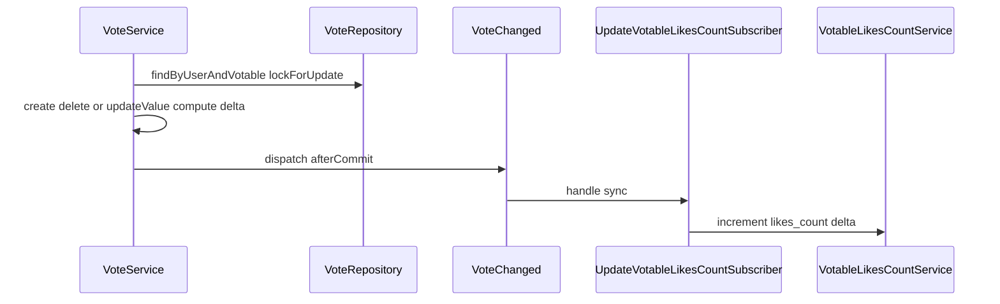
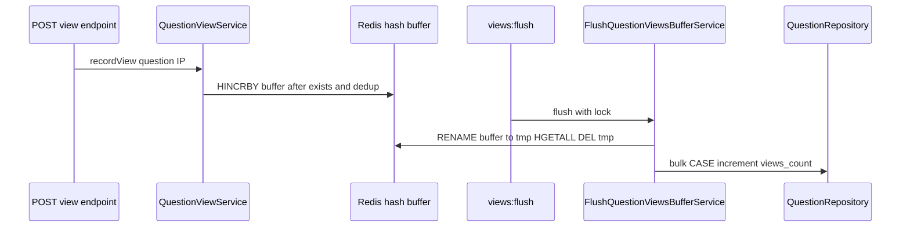

# Этап VIII — голоса (лайки / дизлайки)

> **Документация (реализовано):** [domains/vote/](../domains/vote/), [domains/question/views.md](../domains/question/views.md), [domains/question/aggregates.md](../domains/question/aggregates.md)

Пользователи ставят лайк (`value = 1`) и дизлайк (`value = -1`) на вопросы и комментарии через полиморфную связь `Vote`; на сущностях — денормализованные `likes_count`. Отдельно: буферизация просмотров вопросов (`views_count` через Redis), агрегаты для рейтинга (`met_in_real_interview_count`, `rating_needs_recalculation`). Шаги 01–05 — голоса и Filament; 06–07 — опросы/просмотры и рейтинг (без формулы `rating` в этих шагах).

> В [phase-vii.md](phase-vii.md) голоса упомянуты на уровне roadmap; этот файл — отдельный исполняемый план по домену голосов.

Пошаговый план реализации Этапа VIII. Каждая секция ниже — отдельный шаг для ИИ-агента: контекст, задача, acceptance criteria, **тесты**, ограничения.

## Соглашения по тестам (обязательно для каждого шага)

Следовать [`.cursor/rules/tests.mdc`](../../.cursor/rules/tests.mdc) и образцам в [`tests/Feature/v1/`](../../tests/Feature/v1/).

| Правило | Значение |
|--------|----------|
| Расположение API | `tests/Feature/v1/{Domain}/` — namespace `Feature\v1\{Domain}` |
| Расположение Unit | `tests/Unit/v1/{Domain}/` — для чистой логики без HTTP (калькуляторы, формулы) |
| Базовый класс | `Tests\TestCase` |
| Auth | `App\Traits\Tests\WithUser` + `protected string $permission = '…';` |
| БД | `DatabaseTransactions` (не `RefreshDatabase`); SQLite in-memory (`phpunit.xml`) |
| Очистка таблиц | В `setUp()` — `DB::table('…')->delete()` для затронутых таблиц, если тесту нужен пустой срез (образец: [`QuestionsTest`](../../tests/Feature/v1/Question/QuestionsTest.php)) |
| Имена методов | `test_{actor}_{condition}_{expected}` (snake_case) |
| API-запросы | `postJson` / `deleteJson` / `getJson` + `route('api.v1.…')` |
| Assertions | `assertOk`, `assertForbidden`, `assertUnauthorized`, `assertUnprocessable`, `assertJsonValidationErrors`, `assertDatabaseHas`, `assertJsonPath` |
| Очередь | В `phpunit.xml` — `QUEUE_CONNECTION=sync`; для проверки dispatch — `Bus::fake()` / `Queue::fake()` или явный `$job->handle()` / `Artisan::call()` |
| Завершение шага | Новые и затронутые тесты проходят: `php artisan test --filter=<pattern>` |

**Filament-only шаги:** в проекте нет Filament feature-тестов — автоматизировать **слой данных** (значение агрегата в БД после доменного действия через API/сервис); UI в `/admin` — по чеклисту acceptance criteria.

**Шаблон для новых шагов:**

```markdown
## Шаг NN: <краткий заголовок>

### Контекст
…

### Задача
…

### Acceptance criteria
- [ ] …

### Тесты
- [ ] …

### Ограничения
- …
```

---

## Шаг 01: Добавить сущность голоса

### Контекст

Первый шаг Этапа VIII — доменная модель и схема БД. Зависит от существующих [`Question`](../../app/Models/Question.php) и [`Comment`](../../app/Models/Comment.php) (Этап VII). В репозитории уже есть частичная заготовка:

| Элемент | Статус |
|---------|--------|
| Миграция [`create_votes_table`](../../database/migrations/2025_09_25_154809_create_votes_table.php) | `user_id`, `morphs('votable')`, `value` (tinyInteger), unique `(user_id, votable_id, votable_type)`, timestamps |
| [`Vote`](../../app/Models/Vote.php) | Каркас: `user()`, `votable()`; пустой `$fillable` |
| `questions.likes_count` | Уже в [`create_questions_table`](../../database/migrations/2025_09_25_155342_create_questions_table.php) |
| `comments.likes_count` | Уже в [`create_comments_table`](../../database/migrations/2026_02_01_163946_create_comments_table.php) |
| `Question::votes()` | `morphMany(Vote::class, 'votable')` — есть |
| `Comment` | **Нет** `votes()` |
| Индекс `(votable_type, votable_id)` | `morphs()` создаёт индекс на пару полей — проверить при реализации |
| `Answer` | Будущий `votable_type` — модель не создавать в этом шаге |

Шаг — **доведение до ТЗ**, а не реализация с нуля.

### Задача

1. **Таблица `votes`** (проверить / дополнить миграцию):
   - Поля: `id`, `user_id` (FK → `users`), `votable_id`, `votable_type`, `value` (1 = лайк, -1 = дизлайк), `created_at`, `updated_at`.
   - Уникальный индекс `(user_id, votable_type, votable_id)` — один голос пользователя на объект. При расхождении с текущей миграцией (`votable_id` перед `votable_type`) — additive-миграция `alter`, не править уже применённую в prod без согласования.
   - Индекс `(votable_type, votable_id)` для агрегаций (при необходимости — отдельная миграция).
   - `value`: `tinyInteger` или `smallInteger`; в модели — cast `integer`.

2. **Счётчики** на сущностях:
   - `questions.likes_count` — `integer`, default 0 (уже в create-миграции).
   - `comments.likes_count` — `unsignedInteger`, default 0 (уже в create-миграции).
   - Отдельная миграция только если колонок нет в актуальной БД.

3. **Модель [`Vote`](../../app/Models/Vote.php)**:
   - `$fillable`: `user_id`, `votable_id`, `votable_type`, `value` (или `$guarded` по конвенции проекта).
   - `belongsTo(User::class)`, `morphTo()` — `votable`.
   - PHPDoc для `value` (+1 / -1); enum для value — опционально (YAGNI).

4. **[`Question`](../../app/Models/Question.php)**:
   - Сохранить / проверить `votes(): MorphMany`.
   - `likes_count` — не добавлять в `$fillable`, если обновление счётчика будет в сервисе (следующие шаги).

5. **[`Comment`](../../app/Models/Comment.php)**:
   - Добавить `votes(): MorphMany` → `morphMany(Vote::class, 'votable')`.
   - Cast `likes_count` → `integer` при необходимости.

6. **`User::votes()`**.

### Acceptance criteria

- [ ] Таблица `votes` соответствует ТЗ: поля, unique `(user_id, votable_type, votable_id)`, индекс для агрегаций по votable.
- [ ] `questions` и `comments` имеют `likes_count` с default 0.
- [ ] `Vote`, `Question`, `Comment` — связи `morphMany` / `morphTo` / `belongsTo` согласованы.
- [ ] `php artisan migrate` проходит на актуальной схеме.
- [ ] PHPDoc на английском; без API, Filament и сервисов голосования в этом шаге.
- [ ] Тесты шага реализованы и проходят (см. **Тесты**).

### Тесты

- [ ] **`tests/Feature/v1/Vote/VoteRelationsTest.php`** — `DatabaseTransactions`; в `setUp()` при необходимости очистить `votes`.
- [ ] `test_vote_can_be_created_for_question_with_value_one` — `Vote::create([...])` + `assertDatabaseHas('votes', …)`; связь `$question->votes()` возвращает запись.
- [ ] `test_vote_can_be_created_for_comment_with_morph_relation` — `Comment::factory()` + голос; `$vote->votable` — `Comment`.
- [ ] `test_user_has_many_votes` — `User::factory()` + два голоса; `$user->votes()->count()` === 2.
- [ ] `test_duplicate_vote_for_same_user_and_votable_fails` — второй insert с тем же `(user_id, votable_type, votable_id)` → исключение unique (или `assertDatabaseCount('votes', 1)` при использовании factory/репозитория).
- [ ] `test_new_question_and_comment_have_likes_count_zero` — `Question::factory()` / `Comment::factory()` → `likes_count === 0`.
- [ ] Запуск: `php artisan test --filter=VoteRelationsTest`.

### Ограничения

- Следовать [`.cursor/rules/project-overview.mdc`](../../.cursor/rules/project-overview.mdc), [`.cursor/rules/laravel-architecture.mdc`](../../.cursor/rules/laravel-architecture.mdc).
- **Образец миграций:** [`create_comments_table`](../../database/migrations/2026_02_01_163946_create_comments_table.php), [`create_votes_table`](../../database/migrations/2025_09_25_154809_create_votes_table.php).
- **Не трогать:** API, Filament, [`CommentService`](../../app/Services/api/v1/Comment/CommentService.php), логику инкремента `likes_count`.
- **Не добавлять:** модель `Answer`, endpoints, policies, events, фабрики/сидеры.
- Не ломать уже задеплоенные миграции — только additive migrations при изменении индексов.

---

## Шаг 02: Toggle голоса, событие и синхронное обновление likes_count

### Контекст

После шага 01 есть таблица `votes` и связи моделей. `likes_count` на [`Question`](../../app/Models/Question.php) и [`Comment`](../../app/Models/Comment.php) — **денормализованная сумма голосов** (`+1` / `-1` на пользователя); значение **может быть отрицательным**, если дизлайков больше лайков. Обновление счётчика не дублируется в `VoteService` — по аналогии с [`CommentCreated`](../../app/Events/v1/Comment/CommentCreated.php) → [`UpdateQuestionCommentsCountSubscriber`](../../app/Listeners/v1/Question/UpdateQuestionCommentsCountSubscriber.php) → [`QuestionAggregateService`](../../app/Services/api/v1/Question/QuestionAggregateService.php), но **без `ShouldQueue`** для счётчика, который уходит в API-ответ.

Пересчёт `rating` вопроса — **вне scope** этого шага.



### Задача

1. **Интерфейс `HasLikesCount`** (новый, `app/Interfaces/…`):
   - Контракт для моделей с денормализованным `likes_count` (пока только `Question`, `Comment`).
   - Реализовать интерфейс на [`Question`](../../app/Models/Question.php) и [`Comment`](../../app/Models/Comment.php).
   - [`VotableLikesCountService`](../../app/Services/api/v1/Vote/VotableLikesCountService.php) принимает только `HasLikesCount`.

2. **Схема `likes_count` (signed):**
   - Колонки должны допускать отрицательные значения (`integer`, не `unsignedInteger`).
   - Если в [`create_comments_table`](../../database/migrations/2026_02_01_163946_create_comments_table.php) остаётся `unsignedInteger` — additive-миграция `change` на signed `integer`.

3. **[`VoteRepository`](../../app/Repositories/v1/Vote/VoteRepository.php)** (новый, образец [`StatisticsRepository::findByUserAndQuestion`](../../app/Repositories/v1/StatisticsRepository.php)):
   - `findByUserAndVotable(int $userId, string $votableType, int $votableId): ?Vote` — в транзакции с `lockForUpdate()`.
   - `create(...)`, `updateValue(Vote $vote, int $value)`, `delete(Vote $vote)` — через `Repository::save()` / `delete()`.

4. **[`VoteService::toggle()`](../../app/Services/api/v1/Vote/VoteService.php)** — вся логика в `DB::transaction()`:
   - Вход: `User`, votable (`HasLikesCount` + `Model`), `int $value` (1 или -1).
   - `findByUserAndVotable` + lock.
   - Ветвление:
     - нет записи → `create`, `$delta = $value`;
     - `$existing->value === $value` → `delete`, `$delta = -$existing->value` (снятие голоса);
     - иначе → `updateValue`, `$delta = $value - $existing->value` (смена лайк ↔ дизлайк).
   - **Не** вызывать `$votable->increment()` в сервисе.
   - `DB::afterCommit(fn () => event(new VoteChanged(...)))`.
   - DTO результата (опционально): `?Vote`, `int $delta`.

5. **Событие [`VoteChanged`](../../app/Events/v1/Vote/VoteChanged.php)**:
   - Поля: `HasLikesCount $votable`, `int $delta`.
   - `$delta` — единственный источник правды для `likes_count`; слушатели не пересчитывают delta сами.
   - `VoteService::toggle()` возвращает только `int $delta`; `user_vote` для API — отдельный read из `VoteRepository` (шаг 03).
   - Диспатч только через `afterCommit` из `VoteService`.

6. **[`VotableLikesCountService::applyDelta()`](../../app/Services/api/v1/Vote/VotableLikesCountService.php)**:
   - При `$delta === 0` — no-op.
   - Атомарно: `$votable->newQuery()->whereKey(...)->increment('likes_count', $delta)` (Laravel `increment`, не `DB::raw` с интерполяцией).
   - Без clamp к нулю — отрицательный `likes_count` допустим.

7. **[`UpdateVotableLikesCountSubscriber`](../../app/Listeners/v1/Vote/UpdateVotableLikesCountSubscriber.php)**:
   - **Синхронный** — **без** `ShouldQueue` (в отличие от [`UpdateQuestionCommentsCountSubscriber`](../../app/Listeners/v1/Question/UpdateQuestionCommentsCountSubscriber.php)).
   - `subscribe()` / `handle(VoteChanged $event)` → `VotableLikesCountService::applyDelta($event->votable, $event->delta)`.

8. **Вне scope шага 02:**
   - `RecalculateQuestionRatingListener`, `QuestionRatingService`, `QuestionAggregatesUpdated`.
   - API controller, Form Request, Policy, Resource.
   - Enum для `value` — опционально (YAGNI).

### Acceptance criteria

- [ ] Интерфейс `HasLikesCount` реализован на `Question` и `Comment`; `VotableLikesCountService` типизирован через него.
- [ ] `VoteService::toggle()` в транзакции: find + lock, create / delete / updateValue; корректный `$delta` во всех трёх сценариях.
- [ ] `VoteChanged` диспатчится через `DB::afterCommit` с заполненным `delta`.
- [ ] `UpdateVotableLikesCountSubscriber` выполняется синхронно и атомарно обновляет `likes_count` через `increment`.
- [ ] `likes_count` может стать отрицательным при преобладании дизлайков.
- [ ] Нет слушателя/сервиса пересчёта `rating`.
- [ ] PHPDoc на английском; persist голосов — через repository.
- [ ] Тесты шага реализованы и проходят (см. **Тесты**).

### Тесты

- [ ] **`tests/Feature/v1/Vote/VoteServiceToggleTest.php`** — вызов `VoteService::toggle()` напрямую (без HTTP); `DatabaseTransactions`; очистка `votes`, `questions`, `comments` в `setUp()`.
- [ ] `test_toggle_creates_vote_and_increments_likes_count` — первый лайк (`value = 1`) → запись в `votes`, `questions.likes_count === 1` (после `toggle`, с учётом sync-listener).
- [ ] `test_toggle_same_value_removes_vote_and_decrements_likes_count` — повторный toggle с тем же `value` → голос удалён, `likes_count === 0`.
- [ ] `test_toggle_changes_like_to_dislike_updates_delta` — лайк затем дизлайк → `value = -1`, `likes_count === -1`.
- [ ] `test_toggle_dislike_on_comment_can_make_likes_count_negative` — votable `Comment`, преобладание дизлайков → `likes_count < 0`.
- [ ] `test_vote_changed_dispatched_after_commit` — `Event::fake([VoteChanged::class])` + транзакция: событие **не** до commit, **да** после (или интеграционно: listener отработал и счётчик обновлён).
- [ ] `test_update_votable_likes_count_subscriber_is_not_queued` — listener/subscriber **без** `ShouldQueue` (рефлексия или отсутствие `Illuminate\Contracts\Queue\ShouldQueue`).
- [ ] Запуск: `php artisan test --filter=VoteServiceToggleTest`.

### Ограничения

- Следовать [`.cursor/rules/laravel-architecture.mdc`](../../.cursor/rules/laravel-architecture.mdc): события из сервиса после persist; запись `Vote` — через repository.
- **Образцы:** [`CommentService`](../../app/Services/api/v1/Comment/CommentService.php), [`UpdateQuestionCommentsCountSubscriber`](../../app/Listeners/v1/Question/UpdateQuestionCommentsCountSubscriber.php) (не копировать `ShouldQueue`), [`QuestionAggregateService`](../../app/Services/api/v1/Question/QuestionAggregateService.php).
- **Не трогать:** Filament, [`CommentService`](../../app/Services/api/v1/Comment/CommentService.php), API routes/controllers.
- **Не добавлять:** `RecalculateQuestionRatingListener`, `QuestionRatingService`, очередь для `likes_count`.
- Не вызывать `$votable->increment()` в `VoteService` — только repository для `Vote` и subscriber для `likes_count`.
- Не пересчитывать `likes_count` через `COUNT(*)` / `SUM()` на каждый toggle — только `$delta`.

---

## Шаг 03: Эндпоинты голосования за вопрос

### Контекст

После шага 02 есть [`VoteService::toggle()`](../../app/Services/api/v1/Vote/VoteService.php), событие [`VoteChanged`](../../app/Events/v1/Vote/VoteChanged.php) и синхронное обновление `likes_count`. Нужен API для авторизованных пользователей: поставить/сменить лайк или дизлайк и отменить голос. Маршруты вложены в вопрос — по аналогии с комментариями в [`routes/api/v1/questions.php`](../../routes/api/v1/questions.php). Голосование за комментарии — **вне scope** (отдельный шаг).

`user_vote` в ответе — строковое представление текущего голоса пользователя после операции: `"like"` (`value = 1`), `"dislike"` (`value = -1`), `"none"` (голоса нет).

### Задача

1. **Маршруты** в [`routes/api/v1/questions.php`](../../routes/api/v1/questions.php) (prefix `v1`, имена `api.v1.questions.*`):
   - `POST /api/v1/questions/{question}/vote` → `store` (или `vote`) — `middleware('auth:sanctum')`.
   - `DELETE /api/v1/questions/{question}/vote` → `destroy` — `middleware('auth:sanctum')`.
   - Пример имён: `questions.vote.store`, `questions.vote.destroy`.

2. **Контроллер** — [`VoteController`](../../app/Http/Controllers/v1/VoteController.php) или методы в `QuestionController` (предпочтительно отдельный контроллер / nested resource):
   - Тонкий слой: authorize → DTO / validated input → `VoteService` → Resource/JSON.
   - `store(Question $question, VoteStoreRequest $request)`:
     - Вызов `VoteService::toggle($request->user(), $question, $request->validated('value'))`.
     - Повторный POST с тем же `value`, что уже стоит — по логике шага 02 **снимает** голос (`user_vote: "none"`).
   - `destroy(Question $question, Request $request)`:
     - Отмена голоса: если голос есть — удалить (через `toggle` при совпадении value **или** отдельный метод `remove(User, Question)` в сервисе, если toggle неудобен для DELETE без body).
     - Если голоса не было — идемпотентный ответ с текущим `likes_count` и `user_vote: "none"` (или 404 — зафиксировать в реализации).

3. **Form Request** — [`VoteStoreRequest`](../../app/Http/Requests/v1/Vote/VoteStoreRequest.php):
   - `authorize()` — политика голосования за вопрос (см. п. 4).
   - `value`: `required`, `integer`, `in:1,-1`.

4. **Policy** — расширить [`QuestionPolicy`](../../app/Policies/QuestionPolicy.php) или [`VotePolicy`](../../app/Policies/VotePolicy.php):
   - Метод вроде `vote(User $user, Question $question): bool` — permission (напр. `vote-question` / `create-vote`) + пользователь может видеть вопрос.
   - Зарегистрировать permission в [`config/roles.php`](../../config/roles.php) при необходимости.

5. **JSON Resource / DTO ответа** — [`QuestionVoteResource`](../../app/Http/Resources/v1/QuestionVoteResource.php) или массив:
   ```json
   {
     "likes_count": 4,
     "user_vote": "like"
   }
   ```
   - `likes_count` — `$question->fresh()->likes_count` после sync-listener (шаг 02).
   - `user_vote` — маппинг из текущей записи `Vote` пользователя или `"none"`.

Возможно, здесь будет достаточно вернуть лишь $delta - дальнейшая логика будет размещена на фронте (определение типа, перерасчет)

6. **Сервис / repository (read)**:
   - При необходимости: `VoteRepository::findByUserAndVotable` для формирования `user_vote` в ответе (без дублирования логики toggle).

### Acceptance criteria

- [ ] `POST /api/v1/questions/{question}/vote` с `{ "value": 1 }` или `{ "value": -1 }` под `auth:sanctum` возвращает `likes_count` и `user_vote` (`like` / `dislike`).
- [ ] Повторный POST с тем же `value` снимает голос → `user_vote: "none"`, `likes_count` пересчитан через шаг 02.
- [ ] `DELETE /api/v1/questions/{question}/vote` отменяет голос → `user_vote: "none"`, актуальный `likes_count`.
- [ ] Неавторизованный запрос — 401; запрещённая операция — 403.
- [ ] Контроллер без бизнес-логики; persist — через `VoteService` + repository.
- [ ] Именованные маршруты `api.v1.questions.vote.*`; валидация через Form Request.
- [ ] PHPDoc на английском; сообщения валидации через `__()` при необходимости.
- [ ] Тесты шага реализованы и проходят (см. **Тесты**).

### Тесты

- [ ] **`tests/Feature/v1/Question/QuestionsVoteTest.php`** — `DatabaseTransactions`, `WithUser`; `protected string $permission = 'vote-question';` (или фактическое имя permission из `config/roles.php`).
- [ ] `test_guest_cannot_vote_for_question` — без `actingAs` → `assertUnauthorized()`.
- [ ] `test_user_without_permission_cannot_vote_for_question` — `User::factory()` без permission → `assertForbidden()`.
- [ ] `test_user_can_post_like_and_receives_vote_state` — `postJson(route('api.v1.questions.vote.store', $question), ['value' => 1])` → `assertOk()`, `assertJsonPath('likes_count', 1)`, `assertJsonPath('user_vote', 'like')`; `assertDatabaseHas('votes', …)`.
- [ ] `test_posting_same_like_again_removes_vote` — два POST с `value: 1` → второй ответ `user_vote: none`, `likes_count: 0`.
- [ ] `test_user_can_switch_like_to_dislike` — POST `1`, затем POST `-1` → `user_vote: dislike`, корректный `likes_count`.
- [ ] `test_user_can_delete_vote` — `deleteJson(route('api.v1.questions.vote.destroy', $question))` → `user_vote: none`.
- [ ] `test_invalid_value_returns_validation_error` — `value: 0` или `2` → `assertUnprocessable()` + `assertJsonValidationErrors(['value'])`.
- [ ] Запуск: `php artisan test --filter=QuestionsVoteTest`.

### Ограничения

- Следовать [`.cursor/rules/laravel-architecture.mdc`](../../.cursor/rules/laravel-architecture.mdc), [`.cursor/rules/project-overview.mdc`](../../.cursor/rules/project-overview.mdc).
- **Образцы:** [`CommentController`](../../app/Http/Controllers/v1/CommentController.php), вложенные маршруты комментариев в [`questions.php`](../../routes/api/v1/questions.php), [`QuestionsProposeTest`](../../tests/Feature/v1/Question/QuestionsProposeTest.php).
- **Зависит от:** шаг 02 (`VoteService`, `VoteChanged`, sync `likes_count`).
- **Не добавлять:** голосование за комментарии, Filament, пересчёт `rating`.
- **Не дублировать:** обновление `likes_count` в контроллере — только через событие/сервис шага 02.

---

## Шаг 04: Эндпоинты голосования за комментарий

### Контекст

Шаг 03 добавил API голосования за [`Question`](../../app/Models/Question.php). Контракты для комментария **аналогичны**: `likes_count` (сумма голосов, может быть отрицательной) и `user_vote` (`like` | `dislike` | `none`). Используются те же [`VoteService::toggle()`](../../app/Services/api/v1/Vote/VoteService.php), [`VoteChanged`](../../app/Events/v1/Vote/VoteChanged.php) и sync-listener из шага 02; votable — [`Comment`](../../app/Models/Comment.php) (`HasLikesCount`).

Маршруты комментариев — в [`routes/api/v1/comments.php`](../../routes/api/v1/comments.php) (prefix `comments`, уже с `auth:sanctum` на группе). По образцу шага 03, но binding — `{comment}`.

### Задача

1. **Маршруты** в [`routes/api/v1/comments.php`](../../routes/api/v1/comments.php):
   - `POST /api/v1/comments/{comment}/vote` → `store` (или dedicated action на [`VoteController`](../../app/Http/Controllers/v1/VoteController.php)).
   - `DELETE /api/v1/comments/{comment}/vote` → `destroy`.
   - Имена: `comments.vote.store`, `comments.vote.destroy` (полное: `api.v1.comments.vote.*`).

2. **Контроллер** — расширить [`VoteController`](../../app/Http/Controllers/v1/VoteController.php) из шага 03 (не дублировать логику):
   - `storeComment(Comment $comment, VoteStoreRequest $request)` / единый `store` с типом votable — на усмотрение, без дублирования тела метода (приватный helper или один метод с `HasLikesCount`).
   - `destroyComment(Comment $comment, Request $request)` — аналогично шагу 03 для вопроса.
   - Поведение toggle / DELETE — **как в шаге 03** (повторный POST с тем же `value` → снятие голоса).

3. **Form Request** — переиспользовать [`VoteStoreRequest`](../../app/Http/Requests/v1/Vote/VoteStoreRequest.php) (`value`: `1` | `-1`).

4. **Policy** — [`CommentPolicy`](../../app/Policies/CommentPolicy.php):
   - Метод `vote(User $user, Comment $comment): bool` (или permission `vote-comment` / `create-vote`).
   - Не голосовать за soft-deleted комментарий (если `$comment->trashed()` → deny), если иное не оговорено.

5. **JSON Resource** — переиспользовать [`QuestionVoteResource`](../../app/Http/Resources/v1/QuestionVoteResource.php) или вынести общий [`VoteStateResource`](../../app/Http/Resources/v1/VoteStateResource.php) с полями `likes_count`, `user_vote`:
   ```json
   {
     "likes_count": 2,
     "user_vote": "dislike"
   }
   ```
   - `likes_count` — `$comment->fresh()->likes_count` после sync-listener.

6. **Ответы (контракт = шаг 03)**

   **POST** `{ "value": 1 }` или `{ "value": -1 }`:
   ```json
   { "likes_count": 4, "user_vote": "like" }
   ```

   **DELETE** (отмена):
   ```json
   { "likes_count": 4, "user_vote": "none" }
   ```

### Acceptance criteria

- [ ] `POST /api/v1/comments/{comment}/vote` с `value: 1 | -1` под `auth:sanctum` — ответ `likes_count` + `user_vote`.
- [ ] `DELETE /api/v1/comments/{comment}/vote` — `user_vote: "none"`, актуальный `likes_count`.
- [ ] Повторный POST с тем же `value` снимает голос (как у вопроса).
- [ ] 401 / 403 по политике; нельзя голосовать за удалённый комментарий (если зафиксировано в policy).
- [ ] Без дублирования логики шага 03: общий `VoteService`, общий resource/request где возможно.
- [ ] PHPDoc на английском.
- [ ] Тесты шага реализованы и проходят (см. **Тесты**).

### Тесты

- [ ] **`tests/Feature/v1/Comment/CommentsVoteTest.php`** — по образцу [`QuestionsVoteTest`](../../tests/Feature/v1/Question/QuestionsVoteTest.php): `DatabaseTransactions`, `WithUser`, `protected string $permission = 'vote-comment';` (или фактическое имя из `config/roles.php`).
- [ ] `test_guest_cannot_vote_for_comment` → `assertUnauthorized()`.
- [ ] `test_user_without_permission_cannot_vote_for_comment` → `assertForbidden()`.
- [ ] `test_user_can_post_like_for_comment` — `route('api.v1.comments.vote.store', $comment)` → `likes_count`, `user_vote: like`.
- [ ] `test_posting_same_like_again_removes_vote_on_comment` — идемпотентное снятие, `user_vote: none`.
- [ ] `test_user_can_switch_like_to_dislike_on_comment` — смена `1` → `-1`.
- [ ] `test_user_can_delete_vote_on_comment` — `deleteJson(route('api.v1.comments.vote.destroy', …))`.
- [ ] `test_user_cannot_vote_for_soft_deleted_comment` — `Comment::factory()->create()` + soft delete → `assertForbidden()` (если зафиксировано в policy).
- [ ] `test_invalid_value_returns_validation_error` — `assertUnprocessable()` + `assertJsonValidationErrors(['value'])`.
- [ ] Запуск: `php artisan test --filter=CommentsVoteTest`; регрессия: `QuestionsVoteTest` не ломается.

### Ограничения

- Следовать [`.cursor/rules/laravel-architecture.mdc`](../../.cursor/rules/laravel-architecture.mdc).
- **Образец:** шаг 03 в этом файле; маршруты — [`comments.php`](../../routes/api/v1/comments.php), [`CommentController`](../../app/Http/Controllers/v1/CommentController.php), [`QuestionsVoteTest`](../../tests/Feature/v1/Question/QuestionsVoteTest.php).
- **Зависит от:** шаги 02–03.
- **Не добавлять:** новые эндпоинты для вопроса, Filament, `rating`, дублирующий `VoteService`.
- **Не дублировать:** `increment` / пересчёт `likes_count` в контроллере.

---

## Шаг 05: Поля голосов в Filament (вопрос и комментарий)

### Контекст

После шагов 02–04 `likes_count` на [`Question`](../../app/Models/Question.php) и [`Comment`](../../app/Models/Comment.php) обновляется через API (денормализованная **сумма** голосов, может быть отрицательной). В админке нужно видеть актуальное значение при просмотре и в списках. [`QuestionResource`](../../app/Filament/Resources/QuestionResource.php) уже показывает `rating`, но не `likes_count`; [`CommentResource`](../../app/Filament/Resources/CommentResource.php) — таблица/edit из этапа VII (шаги 01–02 в [phase-vii.md](phase-vii.md)). Голосовать из Filament **не требуется** — только отображение.

### Задача

1. **[`QuestionResource::table()`](../../app/Filament/Resources/QuestionResource.php)**:
   - Колонка `likes_count` — `TextColumn::make('likes_count')`, `sortable()`, label через `__()`.
   - Опционально: `color()` / `badge()` — нейтральный для 0, success при положительном, danger при отрицательном (или без цвета, если шумно).
   - Разместить рядом с `rating` (не путать: `rating` — отдельная метрика, пересчёт вне scope).

2. **[`EditQuestion`](../../app/Filament/Resources/QuestionResource/Pages/EditQuestion.php)** (и/или infolist):
   - Read-only поле `likes_count` — `Placeholder` / `TextEntry` (не редактируемое), по образцу read-only блоков в [`EditUserNotification`](../../app/Filament/Resources/UserNotificationResource/Pages/EditUserNotification.php).
   - При необходимости — `votes_count` через `votes()->count()` только если нужен raw count записей (опционально, YAGNI: достаточно `likes_count`).

3. **[`CommentResource::table()`](../../app/Filament/Resources/CommentResource.php)** (список из phase-vii, шаг 01):
   - Добавить колонку `likes_count` — `sortable()`, тот же стиль sign-aware, что у вопроса.

4. **[`EditComment`](../../app/Filament/Resources/CommentResource/Pages/EditComment.php)** (phase-vii, шаг 02):
   - Read-only `likes_count` в секции метаданных (рядом с автором / датами / статусом удаления).

5. **[`CommentsRelationManager`](../../app/Filament/Resources/QuestionResource/RelationManagers/CommentsRelationManager.php)** (phase-vii, шаг 03), если уже реализован:
   - Колонка `likes_count` в таблице комментариев на странице вопроса (кратко, без дублирования тяжёлой логики).

6. **Общее:**
   - Подписи через `__()`; не добавлять actions голосования в Filament.
   - Не вызывать `VoteService` из resource — только чтение атрибута из БД.

### Acceptance criteria

- [ ] В списке вопросов (`QuestionResource`) отображается и сортируется `likes_count`.
- [ ] На edit вопроса видно read-only `likes_count`.
- [ ] В списке комментариев и на edit комментария видно `likes_count`.
- [ ] В relation manager «Комментарии» на вопросе (если есть) — колонка `likes_count`.
- [ ] Отрицательные значения отображаются корректно (без unsigned-артефактов в UI).
- [ ] Нет кнопок/API-вызовов голосования в админке; PHPDoc не обязателен в resource-классах.
- [ ] Тесты шага реализованы и проходят (см. **Тесты**).

### Тесты

- [ ] **`tests/Feature/v1/Vote/LikesCountPersistenceTest.php`** (или расширение `QuestionsVoteTest` / `CommentsVoteTest`) — проверка **слоя данных** для read-only Filament (UI в `/admin` — ручной чеклист acceptance criteria).
- [ ] `test_question_likes_count_persisted_after_api_vote` — после `QuestionsVoteTest`-сценария `fresh()->likes_count` на модели совпадает с JSON ответа.
- [ ] `test_comment_likes_count_persisted_after_api_vote` — аналогично для комментария; отрицательный `likes_count` сохраняется в БД без unsigned-артефакта.
- [ ] `test_question_factory_exposes_likes_count_attribute` — smoke: `Question::factory()->create(['likes_count' => -2])` → атрибут читается как `-2` (колонка signed).
- [ ] Регрессия: `php artisan test --filter='QuestionsVoteTest|CommentsVoteTest|LikesCountPersistenceTest'`.

### Ограничения

- Следовать [`.cursor/rules/filament.mdc`](../../.cursor/rules/filament.mdc) — UI only, бизнес-логика в сервисах.
- **Образцы:** [`QuestionResource`](../../app/Filament/Resources/QuestionResource.php) (`rating`, `created_at`), [`StatisticsRelationManager`](../../app/Filament/Resources/QuestionResource/RelationManagers/StatisticsRelationManager.php).
- **Зависит от:** шаг 01 phase-vii (список комментариев), шаг 02 phase-vii (edit комментария) — при отсутствии колонок comment сначала phase-vii.
- **Не трогать:** API, `VoteService`, пересчёт `rating`, relation manager голосов.
- **Не добавлять:** редактирование `likes_count` вручную, bulk-голосование, виджеты аналитики.

---

## Шаг 06: Денормализовать хранение встреч на реальных собеседованиях

### Контекст

Пользователи проходят опросы (feedback) и отмечают, встречался ли вопрос на собеседовании. Записи хранятся в [`statistics`](../../database/migrations/2025_10_13_061304_create_statistics_table.php) (`met_in_real_interview` boolean). Количество ответов «встречался» (`met_in_real_interview = true`) — вход для будущего расчёта [`rating`](../../app/Models/Question.php) вопроса; пересчитывать `COUNT(*)` на каждый запрос невыгодно.

Сейчас [`QuestionAggregateService`](../../app/Services/api/v1/Question/QuestionAggregateService.php) инкрементирует только `comments_count` по событиям комментариев; статистика диспатчит [`QuestionStatisticCreated`](../../app/Events/v1/Question/QuestionStatisticCreated.php) из [`QuestionFeedbackService`](../../app/Services/api/v1/QuestionFeedbackService.php) и [`QuestionProposalService`](../../app/Services/api/v1/QuestionProposalService.php). Шаг добавляет денормализованный счётчик на вопросе по тому же паттерну (сервис агрегатов + listener), без реализации формулы `rating` (отдельный шаг).

### Задача

1. **Миграция** — additive, таблица `questions`:
   - `met_in_real_interview_count` — `unsignedInteger` (или `integer`), `default(0)`, `notNull()`.
   - Индекс не обязателен (фильтрация по вопросу — по `id`).

2. **Модель [`Question`](../../app/Models/Question.php)**:
   - Поле доступно для чтения; не в `$fillable` (обновление только через aggregate-сервис).
   - PHPDoc: число записей [`Statistic`](../../app/Models/Statistic.php) с `met_in_real_interview = true` для данного вопроса.

3. **Логика пересчёта** — расширить [`QuestionAggregateService`](../../app/Services/api/v1/Question/QuestionAggregateService.php) **(предпочтительно)**:
   - `incrementMetInRealInterviewCount(Question $question): void` — `$question->increment('met_in_real_interview_count')`.
   - `decrementMetInRealInterviewCount(Question $question): void` — при появлении сценариев удаления/смены `met_in_real_interview` с `true` на `false` (если в домене невозможно — задокументировать и не вызывать).
   - Опционально: `recalculateMetInRealInterviewCount(Question $question): void` — `StatisticsRepository` / query `where('question_id', …)->where('met_in_real_interview', true)->count()` + `update` на вопросе (для reconcile / artisan-команды).
   - После изменения агрегата — зарезервировать TODO / событие `QuestionAggregatesUpdated` (как для `comments_count`) для будущего rating.

   Альтернатива: отдельный `QuestionInterviewMetAggregateService` — только если `QuestionAggregateService` разрастается; по умолчанию — один сервис агрегатов вопроса.

4. **Слушатель** — новый subscriber/listener (по образцу [`UpdateQuestionCommentsCountSubscriber`](../../app/Listeners/v1/Question/UpdateQuestionCommentsCountSubscriber.php)):
   - Слушать [`QuestionStatisticCreated`](../../app/Events/v1/Question/QuestionStatisticCreated.php).
   - Если `$event->statistic->met_in_real_interview === true` → `incrementMetInRealInterviewCount($event->statistic->question)`.
   - Очередь: как у комментариев (`ShouldQueue`) **или** sync — зафиксировать в реализации (для опросов допустима очередь, счётчик не в синхронном API-ответе голосования).
   - Учесть все точки создания `Statistic` с `met_in_real_interview = true` ([`QuestionFeedbackService`](../../app/Services/api/v1/QuestionFeedbackService.php), [`QuestionProposalService`](../../app/Services/api/v1/Question/QuestionProposalService.php)).

5. **Backfill** (опционально, в шаге или отдельно):
   - Artisan-команда / one-off: проставить `met_in_real_interview_count` для существующих вопросов из `statistics`.

6. **Filament / API resources** (опционально в шаге):
   - Колонка `met_in_real_interview_count` в [`QuestionResource`](../../app/Filament/Resources/QuestionResource.php) read-only — по аналогии с шагом 05 (`likes_count`).

### Acceptance criteria

- [ ] В `questions` есть `met_in_real_interview_count`, default 0.
- [ ] При создании statistic с `met_in_real_interview = true` счётчик вопроса увеличивается на 1 (через listener + aggregate-сервис).
- [ ] Инвариант: значение совпадает с `COUNT(*)` по `statistics` где `met_in_real_interview = true` (проверка командой reconcile или тестом).
- [ ] Persist счётчика — `increment` / `update` на модели в aggregate-сервисе, не в [`QuestionFeedbackService`](../../app/Services/api/v1/QuestionFeedbackService.php) напрямую.
- [ ] Формула `rating` не реализуется в этом шаге.
- [ ] PHPDoc на английском.
- [ ] Тесты шага реализованы и проходят (см. **Тесты**).

### Тесты

- [ ] **`tests/Feature/v1/Question/QuestionMetInRealInterviewCountTest.php`** — `DatabaseTransactions`, `WithUser`; очистка `statistics`, `questions` в `setUp()`; permission как у propose/feedback (напр. `propose-question` — по фактическому маршруту).
- [ ] `test_met_in_real_interview_statistic_increments_aggregate` — создание `Statistic` с `met_in_real_interview = true` через существующий API propose/feedback **или** `Event::dispatch(new QuestionStatisticCreated(...))` после persist → `question->fresh()->met_in_real_interview_count === 1`.
- [ ] `test_statistic_with_met_false_does_not_increment_aggregate` — `met_in_real_interview = false` → счётчик остаётся `0`.
- [ ] `test_aggregate_matches_statistics_count` — два statistic с `met = true` на один вопрос → `met_in_real_interview_count === 2` и совпадает с `Statistic::where(...)->count()`.
- [ ] `test_increment_not_done_in_feedback_service_directly` — опционально: spy на `QuestionAggregateService` вызывается из listener, не из `QuestionFeedbackService` (если тестируемо без хрупкого mock всего сервиса).
- [ ] При наличии `recalculateMetInRealInterviewCount` — `test_recalculate_restores_correct_count` через `Artisan::call` или прямой вызов сервиса.
- [ ] Запуск: `php artisan test --filter=QuestionMetInRealInterviewCountTest`.

### Ограничения

- Следовать [`.cursor/rules/laravel-architecture.mdc`](../../.cursor/rules/laravel-architecture.mdc), [`.cursor/rules/repositories.mdc`](../../.cursor/rules/repositories.mdc).
- **Образцы:** [`QuestionAggregateService`](../../app/Services/api/v1/Question/QuestionAggregateService.php), [`UpdateQuestionCommentsCountSubscriber`](../../app/Listeners/v1/Question/UpdateQuestionCommentsCountSubscriber.php), [`StatisticsRepository`](../../app/Repositories/v1/StatisticsRepository.php), [`QuestionsProposeTest`](../../tests/Feature/v1/Question/QuestionsProposeTest.php).
- **Не трогать:** логику опроса в `QuestionFeedbackService` (кроме необходимости диспатча события, если ещё не везде), `VoteService`, Filament комментариев.
- **Не добавлять:** пересчёт `rating`, изменение правил опроса.
- Не пересчитывать `met_in_real_interview_count` через subquery на каждый feedback, если уже есть increment по событию.

---

## Шаг 07: Просмотры вопроса (Redis-буфер, flush, API)

### Контекст

Поле [`questions.views_count`](../../database/migrations/2025_09_25_155342_create_questions_table.php) уже есть; прямой `UPDATE` на каждый HTTP hit создаёт нагрузку на MySQL. Решение — **write-behind**: буфер в Redis (hash), периодический сброс в БД. Задержка `views_count` в API до ~1 минуты **допустима**. Потеря буфера при падении Redis на текущем этапе **допустима**.

Пересчёт [`rating`](../../app/Models/Question.php) — не в этом шаге; при flush выставляется флаг `rating_needs_recalculation` для последующей batch-job.



### Задача

1. **Миграция** — `questions`:
   - `rating_needs_recalculation` — `boolean` (или `tinyInteger`), `default(false)`, `notNull()`.
   - При необходимости индекс для будущей job пересчёта rating.

2. **Redis-ключи** (константы в сервисе):
   - `question:views:buffer` — рабочий hash (`question_id` → accumulated delta).
   - `question:views:buffer:tmp` — временный hash после `RENAME` (имя зафиксировать в коде, напр. `REDIS_HASH_KEY` / `REDIS_HASH_TMP_KEY`).

3. **[`QuestionViewService`](../../app/Services/api/v1/Question/QuestionViewService.php)** — только Redis, без записи в БД:
   - Перед `HINCRBY`: убедиться, что вопрос существует (`Question::query()->whereKey($id)->exists()` или лёгкий cache) — **не писать в буфер** для несуществующих id.
   - **Дедупликация по IP (примитивная):** один засчитанный hit на пару `(question_id, IP)` за окно TTL (напр. 60–300 с) — отдельный ключ Redis `SET` с `NX` + `EX` или аналог; при повторе в окне — не увеличивать buffer.
   - Считать **каждый HTTP hit**, прошедший dedup (не уникальный пользователь).
   - `Redis::hIncrBy(REDIS_HASH_KEY, (string) $questionId, 1)`.

4. **[`FlushQuestionViewsBufferService`](../../app/Services/api/v1/Question/FlushQuestionViewsBufferService.php)**:
   - **Lock:** `Cache::lock('flush-question-views', $ttl)` (дополнительно к `withoutOverlapping` в scheduler).
   - **Атомарное чтение буфера:**
     1. `$redis->rename(REDIS_HASH_KEY, REDIS_HASH_TMP_KEY)` (если buffer пуст — обработать `false` / исключение Redis gracefully, no-op).
     2. Забрать все поля из `REDIS_HASH_TMP_KEY` (`HGETALL`).
     3. Удалить `REDIS_HASH_TMP_KEY`.
     - Новые hits после `RENAME` пишутся в новый пустой `REDIS_HASH_KEY`.
   - **Сброс в БД:** делегировать в [`QuestionRepository::incrementViewsCounts(array $idToDelta)`](../../app/Repositories/v1/Question/QuestionRepository.php):
     - Один **bulk** `UPDATE` с `CASE id WHEN … THEN views_count + … END` (и `rating_needs_recalculation = 1` для затронутых id) — **без** цикла единичных `update` по id в чанке.
     - Чанки только по **размеру массива** id→delta (напр. 200–500 пар на один SQL), не по одному id на запрос.
   - Cast `question_id` и `delta` к `int` перед SQL.

5. **[`QuestionRepository`](../../app/Repositories/v1/Question/QuestionRepository.php)** (новый или расширить существующий для `Question`):
   - `incrementViewsCounts(array $increments): void` — bulk `CASE` update `views_count` + `rating_needs_recalculation = 1`.

6. **Artisan + Job + Schedule:**
   - Команда [`views:flush`](../../app/Console/Commands/FlushQuestionViewsBufferCommand.php) — вызывает `FlushQuestionViewsBufferService::flush()` (удобно для ручного запуска и тестов).
   - [`FlushQuestionViewsBufferJob`](../../app/Jobs/FlushQuestionViewsBufferJob.php) — thin wrapper над ту же команду/сервис.
   - [`routes/console.php`](../../routes/console.php):
     ```php
     Schedule::command('views:flush')->everyMinute()->withoutOverlapping();
     ```
     - Job в очередь опционально вместо command — по умолчанию **command** в schedule; job — для ручного `dispatch` при необходимости.

7. **Очередь Horizon** (если flush через job):
   - Добавить `Queue::ViewsFlush = 'views-flush'` в [`App\Enums\Queue\Queue`](../../app/Enums/Queue/Queue.php).
   - Supervisor в [`config/horizon.php`](../../config/horizon.php) по образцу `notification-supervisor`.

8. **API — запись просмотра:**
   - Маршрут в [`routes/api/v1/questions.php`](../../routes/api/v1/questions.php), напр. `POST /api/v1/questions/{question}/view` → `QuestionViewController::store` или метод в [`QuestionController`](../../app/Http/Controllers/v1/QuestionController.php).
   - Имя: `api.v1.questions.view.store`.
   - **RateLimiter** (`Illuminate\Support\Facades\RateLimiter`): лимит на IP (и/или user), напр. `question-view:{ip}` — max N попыток в минуту; при превышении — `429`.
   - Контроллер: thin — rate limit → `QuestionViewService::recordView($question, $request->ip())` → `204 No Content` или `{ "accepted": true }` (без актуального `views_count` в ответе — задержка допустима).
   - Авторизация: публичный endpoint (guest + auth), если иное не требуется политикой.

9. **Filament (опционально):** read-only `views_count` на [`QuestionResource`](../../app/Filament/Resources/QuestionResource.php) — по аналогии с шагом 05.

### Acceptance criteria

- [ ] `rating_needs_recalculation` в `questions`; выставляется в `1`/`true` при bulk flush для обновлённых id.
- [ ] `QuestionViewService` пишет только в Redis; несуществующие `question_id` не попадают в buffer.
- [ ] Дедуп по IP в окне TTL работает; повторные hits в окне не увеличивают buffer.
- [ ] Flush: `rename` → read tmp → del tmp; параллельные hits не теряются некорректно (новые — в новый buffer).
- [ ] `withoutOverlapping` + lock `flush-question-views` на время сброса.
- [ ] `QuestionRepository::incrementViewsCounts` — bulk `CASE`, без N отдельных `UPDATE` на id.
- [ ] `php artisan views:flush` сбрасывает buffer в `views_count`.
- [ ] Schedule `views:flush` каждую минуту.
- [ ] `POST …/questions/{question}/view` с RateLimiter; 429 при flood.
- [ ] Формула `rating` не пересчитывается в этом шаге.
- [ ] PHPDoc на английском.
- [ ] Тесты шага реализованы и проходят (см. **Тесты**).

### Тесты

- [ ] **`tests/Feature/v1/Question/QuestionViewsTest.php`** — API запись просмотра:
  - `test_guest_can_record_view` — `postJson(route('api.v1.questions.view.store', $question))` → `204` или `{ "accepted": true }` (по контракту шага).
  - `test_nonexistent_question_returns_not_found` — невалидный id → `404`.
  - `test_rate_limiter_returns_429_when_exceeded` — серия запросов с одного IP → `assertStatus(429)` (при необходимости `RateLimiter::clear` в `setUp` / `withoutMiddleware` только если иначе нестабильно — предпочтительно реальный limiter с подменой лимита в `config` для теста).
  - `test_dedup_within_ttl_does_not_double_buffer` — два hit с одним IP в окне TTL → в Redis buffer delta `1` (проверка через `Redis::connection()` или spy на `QuestionViewService`).
- [ ] **`tests/Feature/v1/Question/FlushQuestionViewsTest.php`** — flush и БД:
  - `setUp`: `Redis::fake()` или тестовый Redis; очистка `questions`.
  - `test_flush_increments_views_count_in_database` — положить delta в buffer → `Artisan::call('views:flush')` → `views_count` увеличился.
  - `test_flush_sets_rating_needs_recalculation_for_touched_questions` — после flush `rating_needs_recalculation === true`.
  - `test_flush_with_empty_buffer_is_no_op` — без ошибок, `views_count` не меняется.
  - `test_nonexistent_question_id_not_buffered` — `recordView` для несуществующего id не увеличивает buffer.
- [ ] Запуск: `php artisan test --filter='QuestionViewsTest|FlushQuestionViewsTest'`.

### Ограничения

- Следовать [`.cursor/rules/laravel-architecture.mdc`](../../.cursor/rules/laravel-architecture.mdc), [`.cursor/rules/repositories.mdc`](../../.cursor/rules/repositories.mdc).
- **Образцы:** [`QuestionAggregateService`](../../app/Services/api/v1/Question/QuestionAggregateService.php) (агрегаты на вопросе), [`routes/console.php`](../../routes/console.php), [`Queue`](../../app/Enums/Queue/Queue.php) + Horizon.
- **Не добавлять:** job пересчёта `rating`, уникальные просмотры по user_id, гарантию durability Redis.
- **Не использовать:** единичный `UPDATE` per `question_id` в цикле flush; прямой `increment` в `QuestionViewService`.
- Persist `views_count` — только через `FlushQuestionViewsBufferService` → repository.
